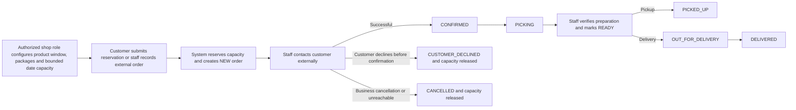

# 04 — Business and User Flows

> **v0.0.1 flow override — ADR-0005 applies.** Use one shop, Admin/Manager/Staff/Content Creator permissions, manual phone/other order sources, delivery always “Delivery to be agreed” with an optional manual fee, fixed-page four-image CMS, record-only external pickers, and picking records in litres or kilograms with unit-specific buy prices. Google, Meta/WhatsApp, tenant provisioning, supplier/expense/reporting, and marketing flows below are deferred.

## 1. End-to-end business flow

## 2. Customer ordering flow

1. Customer opens Home and sees active product/package/date information, exact positive remaining litres, or a localized “Sold out” banner without an internal reason/numeric remainder.
2. Customer selects an Order CTA; selected context is carried to the form.
3. Customer chooses product, one fixed package, and fulfillment date; public quantity is implicitly 1.
4. System shows live calculated litres, item price, availability, and allowed fulfillment methods. Public MVP ordering uses one item line with fixed quantity 1 and no quantity control; the server rejects manipulated non-1 input.
5. Customer chooses pickup or delivery.
6. Pickup shows the selected location's complete address, localized instructions, and time slot. Delivery always shows “Delivery to be agreed”; no route or provider call is made. An authorized Admin/Manager/Staff user may later record a fee and reason while the item subtotal remains authoritative.
7. Customer enters name, mobile number, optional email/Messenger, notes, acknowledges privacy information, and optionally opts into marketing.
8. On submit, server verifies the signed route/fee quote and current origin/rule version, recomputes it when stale, then revalidates product/date/capacity/fee and atomically stores customer (normal, matched, or provisional under identity-conflict rules), order, snapshots, capacity reservation, and audit event.
9. After commit, pickup success shows the snapshotted pickup address, instructions, and time; delivery success shows the destination and final/pending fee state. It remains a reservation-submission acknowledgement, not a false confirmation.
9. Customer receives an on-screen reference. No email or message is sent.
10. Staff receives an in-app notification and optional email.

Exceptions:

- Sold-out/capacity race: order is not created; latest availability is shown.
- Invalid/closed date: customer selects another date.
- Outside delivery area: order may be submitted with delivery “to be agreed”; staff must agree details before confirming.
- Repeat submit: idempotency returns the original successful receipt rather than creating a duplicate.

## 3. Staff confirmation flow

1. Staff opens the new-order notification or filtered Orders list.
2. Staff reviews contact details, order, capacity, delivery/pickup details, and any warnings.
3. Staff records a phone/other contact attempt outside the system when needed.
4. If agreed, Staff confirms order. If it is today after picking start and before cutoff, it immediately enters `PICKING`; otherwise it enters `CONFIRMED`.
5. If customer explicitly declines before confirmation, Staff selects `CUSTOMER_DECLINED` and reason; if contact fails/business cancels, select `CANCELLED`. Capacity is released.
6. If order is still `NEW` after 15 minutes, the system marks it overdue and sends the configured admin reminder.

If a customer cancels after confirmation, Staff selects `CANCELLED_BY_CUSTOMER`; it is reported separately from pre-confirmation decline and business cancellation.

## 4. Manual external order flow

1. Manager/permitted Staff selects Create Order.
2. Selects source: website, phone, or other.
3. Searches for a customer by mobile/email/Messenger; resolves ambiguous results or creates a new customer.
4. Enters one or more items, one shared date/method, fulfillment, fee/payment data, and internal notes.
5. Creates as `NEW` if confirmation is still needed, or `CONFIRMED` if already agreed.
6. The system performs the same price, capacity, snapshot, and audit rules as the public flow.

Historical completed-order variant:

1. User selects “Record completed order.”
2. Enters actual fulfillment date/time, `PICKED_UP` or `DELIVERED`, method, amounts, payment method/status, order source, and reason/evidence note.
3. System stores the order without modifying historical availability, records an explicit historical-entry audit event, and includes its actual fulfillment/outcome in the corresponding reports.

## 5. Pickup fulfillment flow

1. Eligible order enters `PICKING` at the configured time or upon late same-day confirmation.
2. Staff prepares it and manually marks it `READY`.
3. Customer uses the snapshotted address/instructions shown during checkout and after successful submission, then arrives at the configured pickup location/time.
4. Staff records payment information and marks `PICKED_UP`.
5. If customer does not arrive, mark `NO_SHOW`; if customer refuses prepared goods, mark `REJECTED`.
6. A completed pickup may receive partial refunds while remaining `PICKED_UP`; only a full cumulative refund becomes `REFUNDED`.

## 6. Delivery fulfillment flow

1. Eligible order enters `PICKING`; staff prepares and marks it `READY`.
2. Staff confirms unresolved outside-area delivery agreement and fee before dispatch.
3. Staff marks `OUT_FOR_DELIVERY`.
4. Successful handover becomes `DELIVERED`.
5. Failed attendance becomes `NO_SHOW`; refusal becomes `REJECTED`.
6. A delivered order may receive partial refunds while remaining `DELIVERED`; only a full cumulative refund becomes `REFUNDED`.

## 7. Product and availability management flow

1. Admin, Manager, Staff, or Content Creator with product permission opens the Product module and creates/updates localized product identity, public state, and inclusive availability start/end dates.
2. Manager/Staff manages package litres/prices. Content Editor may view package facts but cannot change prices or per-date capacity.
3. Hard delete is available only for an unreferenced product; otherwise the user archives it and retained snapshots/history remain valid.
4. Platform Admin in explicit selected-shop context, Manager, or Staff selects the product and planning mode: one day, ISO week, calendar month, or custom range.
5. UI disables dates outside the product window and historical dates, but keeps the current business date editable even after its public order cutoff. The user enters capacity litres, order acceptance, cutoff, pickup settings, optional timing overrides, and may set/clear a daily manual sold-out override with an internal reason.
6. System resolves the selection to explicit business dates, displays current reserved/projected remaining litres, and validates every date server-side.
7. If any date is outside the product window or a reduction is below reserved litres, the entire batch is rejected with no partial update and an actionable explanation.
8. Shortening a product window across retained dated facts is blocked. Future unreserved availability outside the new window must be explicitly removed with confirmation before/in the same transaction.
9. Valid changes update public availability without a deployment and are audited. A current-day capacity edit cannot reduce capacity below reserved litres and does not itself reopen ordering after cutoff. Manual sold-out blocks new orders and shows only “Sold out” publicly; it leaves existing reservations and all transactional/reporting totals unchanged.

## 8. Review flow

Public submission:

1. Visitor submits display name, rating, optional product, review, privacy/publication acknowledgement, and anti-spam challenge.
2. Review is stored as `PENDING`; nothing is published.
3. Manager/permitted Staff reviews original content, optionally creates edited display text, and approves/rejects.
4. Approved review may be published and featured. Hiding it removes it publicly without deleting audit history.

Manager/Staff-created review follows the same provenance/audit rules and requires a source note.

## 9. Picker application flow

1. Visitor reads Become a Picker and submits identity/contact, location, vehicle availability, produce interests, expected daily amount, availability, notes, and privacy acknowledgement.
2. Application enters `NEW`; Manager/permitted Staff is notified.
3. Staff records contact and moves through `CONTACTED`, `APPROVED`, then optionally `ACTIVE`/`INACTIVE`, or `REJECTED`.
4. No user account, output tracking, or payment record is created.

## 10. Contact flow

1. Visitor submits contact details, category, subject, message, and privacy acknowledgement.
2. Message enters `NEW`; Manager/permitted Staff is notified.
3. Staff opens it (`READ`), records assignment/notes, replies outside the platform, records reply (`REPLIED`), then closes it.

## 11. CMS publishing flow

1. Admin/Manager/Staff/Content Creator with `cms.edit` opens a fixed page and edits Finnish/English content, including up to four images.
2. Saves a draft and previews both desktop/mobile presentation.
3. Validation checks required localized fields, links, image formats, and alternative text.
4. Authorized user publishes; a revision is created.
5. Public cache/content updates. A prior revision can be restored as a new draft and republished.

## 12. Staff picking and earnings flow

1. Staff or an authorized operator creates a picking record for one staff member or external picker, product, and picking date.
2. The record selects exactly one quantity unit: `LITRE` or `KILOGRAM`, enters a positive quantity, and stores a buy price per selected unit (`€/L` or `€/kg`) plus the calculated total.
3. The creator reviews the calculated total, then submits it.
4. Admin/Manager validates and approves/rejects the record, including their own submitted record; each action is audited.
5. An authorized user later marks the record paid with payment date/method/reference. This changes cash/payment status but does not count the amount again.
6. Customer orders and capacity remain litres-only; picking records are not allocated to individual customer orders.

## 13. Supplier and external berry purchase flow

1. Manager creates or selects a Supplier profile for the external picker.
2. Manager/permitted Staff records product, grade, purchase/picking date, litres, effective rate or justified total, payment state, receipt/reference, and notes.
3. System calculates cost and snapshots supplier/product/pricing; the creator submits it.
4. Manager—or Platform Admin in selected-shop context—approves/rejects it, including their own submitted purchase. Approved purchase cost enters non-staff operating costs.
5. Payment may be recorded later without duplicating the recognized cost.

## 14. Expense flow

1. Manager/permitted Staff enters date, category, payee/supplier, amount, future VAT representation where configured, receipt/reference, and notes.
2. Selects one-time, recurring, or manual-allocation treatment.
3. For manual allocation, allocated period amounts must reconcile to the source total.
4. Manager—or Platform Admin in selected-shop context—approves/rejects the expense, including their own submitted expense; each workflow action remains audited.
5. Approved amounts appear in relevant financial periods. Payment state is tracked separately.

## 15. Reporting and export flow

1. Authorized user chooses ISO week or custom date range and optional product/staff/method/source filters.
2. System displays recognized revenue, refunds, net revenue, non-staff costs, result before staff picking cost, staff picking cost, and estimated profit after staff picking cost.
3. Operational sections show volume, orders, fulfillment, delivery, capacity, customer, and timing measures.
4. User drills from an aggregate into the permitted source records.
5. User exports CSV or PDF. Export snapshots filters, formulas, generation time/timezone, data cutoff, and requesting user, and enforces the same privacy permissions.

## 16. Invoice PDF flow

1. Authorized user opens an eligible order and previews an invoice using current seller settings and order snapshots.
2. System validates required seller/customer/tax/payment fields.
3. On issue, it assigns a unique invoice number and immutable version snapshot.
4. User downloads a rendered PDF; the event is audited.
5. No customer email is sent automatically in MVP. An authorized user may download it or explicitly attach/link it through a supported compliant channel action; future email delivery may consume the invoice-issued event.

## 17. Tenant/shop provisioning and operation

1. Platform Admin creates a shop with identity, public slug/host, defaults, initial entitlement placeholder, and primary Manager.
2. System seeds isolated roles/settings/order sources/content/catalog defaults and verifies that all records use the new tenant.
3. Manager accepts membership and configures shop branding, products/media, operations, users, privacy statements, and channel connections.
4. Public host/slug resolves to the shop before showing content or accepting forms.
5. Manager/Staff work only inside selected assigned shop; switching shops changes explicit context and never combines data.
6. Platform Admin must select the shop visibly before inheriting every Manager action; the context and actions are audited.

Self-service merchant signup and monthly subscription charging are future flows, not MVP.

## 18. Form-abandonment analytics flow

1. Visitor is shown the shop’s privacy/preferences experience.
2. If analytics is allowed, the site creates a short-lived pseudonymous tenant session and emits allowed page/form events without form values.
3. `FORM_STARTED` is emitted once when meaningful interaction begins; submit attempts/success use stable non-PII event types.
4. If no successful submission occurs before session expiry, reporting derives an abandoned session.
5. Funnel report separately shows analytics-eligible views/starts/abandonment and authoritative submitted/status outcomes, plus consent coverage/exclusions.

## 19. Channel connection and scheduled social publishing

1. Manager connects a Facebook Page or WhatsApp Business account through provider authorization; system records capabilities and health.
2. Authorized user creates localized text/media/link draft and chooses Page, Group manual-share package, or WhatsApp audience.
3. User previews provider-specific rendering and warnings. Required sender permission/approval is checked.
4. User publishes now or schedules in shop timezone.
5. Worker revalidates connection/capability/permission and, for messages, consent/suppression/template/window eligibility.
6. Provider result/status is recorded. Facebook Group MVP presents the approved copy/media/manual-share action; it never claims automatic publish.

## 20. WhatsApp campaign and segmentation flow

1. Manager/authorized user defines a reusable segment from approved shop customer/order/area/source/consent criteria.
2. System previews eligible/excluded counts and reasons.
3. User composes or selects an approved provider template, variables, locale, purpose, and schedule.
4. At dispatch, membership and consent are re-evaluated; unsubscribed, missing-channel, frequency-blocked, invalid-template, or otherwise ineligible recipients are skipped.
5. Each eligible recipient is sent idempotently and delivery/read/failure callbacks update results.
6. Opt-out/withdrawal immediately suppresses future marketing dispatch for that channel.

## 21. Shared inbox flow

1. Provider sends a signed webhook for inbound message/reply.
2. System verifies/deduplicates it, maps provider account to shop, and creates/updates a conversation.
3. Stable provider identifier/mobile attempts customer match; display name alone only suggests a match. Staff confirms ambiguous linking.
4. Conversation enters shared inbox, may be assigned/tagged and linked to order/customer.
5. Authorized user replies. System checks provider window/template/capability and distinguishes internal note from sendable content.
6. Thread moves through `OPEN`, `PENDING`, and `CLOSED`; provider delivery states remain separate from thread status.
