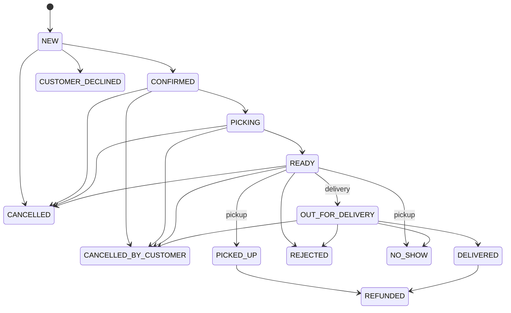

# 05 — Order Lifecycle and Automation

## 1. Canonical statuses

| Status | Meaning | Terminal? | Holds/consumes capacity? |
|---|---|---:|---:|
| `NEW` | Received, awaiting staff agreement | No | Yes |
| `CONFIRMED` | Customer agreement recorded | No | Yes |
| `PICKING` | Fulfillment work has started | No | Yes |
| `READY` | Staff verified prepared and ready | No | Yes |
| `OUT_FOR_DELIVERY` | Delivery order dispatched | No | Yes |
| `PICKED_UP` | Pickup completed | Operationally yes | Consumed |
| `DELIVERED` | Delivery completed | Operationally yes | Consumed |
| `CUSTOMER_DECLINED` | Customer declined before confirmation | Yes | Released once |
| `CANCELLED` | Shop/business stopped order before handover | Yes | Released from `NEW`/`CONFIRMED`; consumed/waste from later states |
| `CANCELLED_BY_CUSTOMER` | Customer cancelled after confirmation | Yes | Released from `CONFIRMED`; consumed/waste from later states |
| `REJECTED` | Prepared order refused by customer | Yes | Consumed; not restored |
| `NO_SHOW` | Customer unavailable/did not collect | Yes | Consumed; not restored |
| `REFUNDED` | Completed order financially refunded | Yes | Historical consumption unchanged |

Use `PICKED_UP`, not the non-standard spelling `PICKUPED`.

## 2. State diagram



Historical entry is a privileged creation path into an evidence-appropriate terminal outcome, not a normal live transition. A historical refund must record its prior `PICKED_UP`/`DELIVERED` completion fact followed chronologically by the refund event; it may not create a bare unexplained `REFUNDED` order.

## 3. Transition controls

| From → To | Actor | Required information/condition |
|---|---|---|
| `NEW → CONFIRMED` | Manager/Staff | Contact/agreement channel and timestamp; delivery agreement if required |
| `NEW → CUSTOMER_DECLINED` | Manager/Staff | Explicit customer decision; decline reason |
| `NEW → CANCELLED` | Manager/Staff | Reason; contact attempts recommended/required by configured policy |
| `CONFIRMED → PICKING` | System or Manager/Staff | Fulfillment date today; scheduled 10:00 or eligible same-day confirmation |
| `CONFIRMED → CANCELLED` | Manager/Staff | Business/unreachable reason and warning |
| `CONFIRMED/PICKING/READY → CANCELLED_BY_CUSTOMER` | Manager/Staff | Customer-initiated cancellation, reason, timestamp, warning |
| `PICKING → READY` | Manager/Staff | Human confirmation that preparation is complete |
| `PICKING → CANCELLED` | Manager/Staff | Reason and high-impact warning |
| `READY → PICKED_UP` | Manager/Staff | Pickup order; actual handover time; payment check |
| `READY → OUT_FOR_DELIVERY` | Manager/Staff | Delivery order; resolved fee/address; dispatch time |
| `READY → CANCELLED/REJECTED/NO_SHOW` | Manager/Staff | Reason and notes |
| `OUT_FOR_DELIVERY → DELIVERED` | Manager/Staff | Actual delivery time; payment check |
| `OUT_FOR_DELIVERY → CANCELLED_BY_CUSTOMER` | Manager/Staff | Customer cancellation before handover; reason/time and high-impact warning |
| `OUT_FOR_DELIVERY → REJECTED/NO_SHOW` | Manager/Staff | Reason and attempt notes |
| Completed → `REFUNDED` | Manager or Staff with explicit permission | Full refundable amount reached, payment records, reason, timestamp; a partial refund leaves order completed and sets payment summary `PARTIALLY_REFUNDED` |

## 4. Automated picking rule

Default configuration:

- Picking start: 10:00.
- Ready review/reminder: 19:00.
- Timezone: shop-configured IANA timezone, initially `Europe/Helsinki`.
- Same-day cutoff: configurable; no fixed value is assumed in this baseline.

At 10:00, the scheduler selects orders where:

```text
fulfillment_date = current business date
AND status = CONFIRMED
```

Each is transitioned to `PICKING` using the normal state service and an audit actor of `SYSTEM`. The job is safe to rerun.

When an order for today is confirmed:

- Before 10:00: remain `CONFIRMED`.
- At/after 10:00 and at/before cutoff: enter `PICKING` immediately.
- After cutoff: normal public ordering is unavailable; privileged manual override requires reason.

The original creation date does not influence this rule.

## 5. Ready review rule

At 19:00, all today’s orders still in `PICKING` are marked operationally overdue and included in an in-app notification plus optional user-configured email.

The scheduler must **not** change them to `READY`. Staff may open the filtered list and bulk-confirm eligible orders as `READY`.

## 6. New-order reminder

- Due time: `created_at + 15 minutes`.
- Eligibility at dispatch: status still `NEW`.
- Initial reminder: exactly once per order.
- Visibility: order overdue flag, dashboard count, in-app notification.
- Email: delivered only to eligible portal users who enabled the relevant category.
- Opening/viewing the order does not resolve the reminder. Transition to `CONFIRMED`, `CUSTOMER_DECLINED`, or `CANCELLED` resolves it.

## 7. Scheduler reliability

- Use durable scheduled jobs/outbox records rather than process-memory timers.
- Store unique event keys such as `order:{id}:new-overdue:v1` and `business-date:{date}:picking-start:v1`.
- On restart, execute missed eligible work.
- Lock/compare current status during transitions to avoid overriding human actions.
- Record scheduled time, actual execution time, result, retry count, and error.
- Dead-letter or surface repeatedly failing shop jobs to Manager and platform failures to Platform Admin.
- Daylight-saving changes must not cause double processing.

## 8. Capacity effects by transition

Capacity is reserved when an order is first created in `NEW`/`CONFIRMED`. Normal forward transitions do not reserve again. `CUSTOMER_DECLINED` and cancellation from `NEW`/`CONFIRMED` release once. Cancellation from `PICKING`, `READY`, or `OUT_FOR_DELIVERY`, plus `REJECTED`, `NO_SHOW`, partial/full refunds, do not release availability because picking/preparation has begun or the period is historical. These outcomes record consumed/waste litres for operational reporting.

Any attempt to replay a transition must be idempotent and must not modify capacity twice.
