# 07 — Logical Data Model

> **v0.0.1 scope override — ADR-0005 applies.** The pilot stores one shop’s records; tenant/membership/platform entities, Google quote/provider entities, channel entities, supplier/expense/quality/reporting entities, and analytics are future roadmap. The minimum live model is users/permissions, customers, products/packages/media, availability, pickup, orders, payments, invoices, picker records, picking entries, CMS revisions, and audit events.

This is a technology-neutral relational model. Identifiers are opaque UUID-like values unless implementation constraints dictate otherwise. Monetary values use fixed-point minor units or exact decimals, never floating-point.

## 1. Relationship overview

```mermaid
erDiagram
    CUSTOMER ||--o{ ORDER : places
    ORDER ||--|{ ORDER_ITEM : contains
    PRODUCT ||--o{ PACKAGE : offers
    PRODUCT ||--o{ AVAILABILITY : has
    PRODUCT ||--o{ ORDER_ITEM : snapshotted_from
    PACKAGE ||--o{ ORDER_ITEM : snapshotted_from
    ORDER ||--o{ ORDER_STATUS_HISTORY : changes
    ORDER ||--o{ PAYMENT_RECORD : records
    ORDER ||--o{ CONTACT_ATTEMPT : has
    PICKUP_LOCATION ||--o{ ORDER : selected_by
    DELIVERY_RULE ||--o{ ORDER : applied_to
    CUSTOMER ||--o{ CONSENT_EVENT : gives
    CMS_PAGE ||--o{ CMS_REVISION : versions
    TENANT_MEMBERSHIP }o--o{ ROLE : assigned
    ROLE }o--o{ PERMISSION : grants
    USER ||--o{ AUDIT_EVENT : acts
    USER ||--o{ PICKING_ENTRY : earns
    SUPPLIER ||--o{ EXTERNAL_PURCHASE : supplies
    PRODUCT ||--o{ EXTERNAL_PURCHASE : purchased_as
    EXPENSE ||--o{ EXPENSE_ALLOCATION : allocated_by
    ORDER ||--o{ INVOICE : billed_by
    TENANT ||--o{ TENANT_MEMBERSHIP : has
    USER ||--o{ TENANT_MEMBERSHIP : belongs_through
    TENANT ||--o{ PRODUCT : owns
    PRODUCT ||--o{ PRODUCT_MEDIA : presents
    TENANT ||--o{ CUSTOMER : owns
    CUSTOMER }o--o| CUSTOMER_AREA : classified_in
    ORDER_SOURCE ||--o{ ORDER : attributes
    QUALITY_GRADE ||--o{ EXTERNAL_PURCHASE : grades
    CHANNEL_CONNECTION ||--o{ CONVERSATION : receives
    CONVERSATION ||--o{ CHANNEL_MESSAGE : contains
    CUSTOMER_SEGMENT ||--o{ MESSAGE_CAMPAIGN : targets
    ANALYTICS_SESSION ||--o{ FUNNEL_EVENT : contains
```



## 2. Core commerce entities

### Customer

`id`, `display_name`, normalized/raw primary mobile, normalized/raw email, default address, internal notes, lifecycle state, optional provisional/match-review state and conflict references, anonymized timestamp, created/updated timestamps. Connector identifiers and customer-area classification are future fields.

Indexes: normalized mobile, normalized email, normalized Messenger identifier, search name. Unique constraints should account for nulls and deliberate shared contact details; duplicate detection may be advisory rather than globally unique.

### Order

`id`, `public_reference`, `customer_id`, manually recorded order source, `status`, fulfillment date/method, pickup snapshot, delivery address/details, manual delivery fee/reason/actor/timestamp snapshot, item subtotal, nullable/pending delivery fee, nullable final total, currency, payment summary, customer identity/contact snapshot, notes, manual/historical flags, capacity-effect state, overdue flags, created/updated/fulfilled/outcome timestamps, version.

The `version` supports optimistic concurrency. Snapshot fields are deliberate duplication to preserve history.

### OrderItem

`id`, `order_id`, product/package references, product/package localized snapshot, package litres snapshot, quantity integer, total litres, unit price, line total, applicable tax snapshot if later required.

Constraints: quantity > 0; litres > 0; amounts >= 0; derived totals verified by service/domain logic.

Public MVP orders contain exactly one item. Manual/historical orders may contain multiple items sharing one fulfillment date and method.

### Product

`id`, `tenant_id`, stable code/slug, base capacity unit (`LITRE`), localized names/descriptions, inclusive `available_from`/`available_through` business dates, season metadata, active/public state, display order, created/updated/archive timestamps. Start must not follow end.

### ProductMedia

Product/page, media type `IMAGE`, storage/object reference, MIME/dimensions/size, primary/order/active state, localized caption/alt metadata, processing/security status, rights/source notes, timestamps. A product/page may have at most four images. Video is future scope.

### Package

`id`, tenant/product, localized label, litre amount, price/currency, active dates/state, display order, timestamps/archive. Public MVP quantity is fixed to 1 in the order contract; manual/historical order items may store another positive integer quantity.

### Availability

One logical row per `product_id + business_date`: capacity litres, reserved litres or derived reservation ledger summary, accepts-orders flag, `manual_sold_out`, private override reason/actor/set/cleared timestamps, cutoff/timing/pickup overrides, effective public state, version, notes, timestamps. Every business date must fall within the referenced product's inclusive availability window. Day/week/month/custom range operations are commands, not separate storage shapes; they resolve atomically to these date rows. Today and future rows are editable; historical rows are retained as facts. The accepts-orders flag represents ordinary scheduling closure; manual sold-out is a distinct presentation/order-acceptance override and creates no capacity movement.

Recommended invariant:

```text
capacity_litres >= 0
reserved_litres >= 0
reserved_litres <= capacity_litres
remaining_litres = capacity_litres - reserved_litres
```

A reservation ledger is preferable when explainability is important:

`CapacityMovement(id, product_id, business_date, order_id, delta_litres, reason, idempotency_key, created_at)`.

The sum of movements must reconcile to reserved capacity.

## 3. Fulfillment and payment

### PickupLocation / PickupSlot

Localized identity/instructions, structured customer-visible street address/postal code/city/access details, timezone, active period; slots/defaults/overrides with weekday or specific date, start/end time, optional capacity. Orders snapshot the selected display identity, address, instructions, and slot so later configuration changes do not rewrite customer history.

### DeliveryOrigin / DeliveryRule (pilot)

DeliveryOrigin stores the customer-visible dispatch name/address/instructions. The order stores delivery details and optional manually agreed fee/reason/actor/timestamp. Distance rules, postal zones, provider settings, delivery quotes, Google responses, and route geometry are deferred.

### CustomerArea

Tenant, stable code, localized label, postal-code/address mapping rules, active state/order, timestamps. Customer stores current optional area and derivation provenance; order stores area snapshot for historical reports.

### OrderSource

Tenant, stable immutable source code, localized label, category/channel, optional channel-connection reference, active/archive state, display order, timestamps. Order snapshots source identity. Optional attribution record stores campaign/referrer codes for future reporting.

### PaymentRecord

Order, record type, method, status, amount/currency, paid/refunded timestamps, external reference (future use), recorded actor, reason, metadata. Multiple records support partial refunds now while the order stores a calculated summary. Cumulative refunds cannot exceed the refundable amount; partial refund does not replace the completed fulfillment status.

## 4. Operational history

### OrderStatusHistory

Order, from/to status, actor type/id, reason code/note, scheduled/manual flag, occurred timestamp, request/correlation ID. Append-only.

### ContactAttempt

Order/customer, channel, direction, outcome, occurred timestamp, user, note.

### AuditEvent

Actor, action, entity type/id, timestamp, request ID, safe before/after change summary, reason, source. Audit records must avoid secrets and excessive personal-data duplication.

### ScheduledJob / OutboxEvent

Unique key, type, entity/business date, scheduled/processed timestamp, state, attempts, last error, payload/version. Supports durable idempotent automation and notifications.

## 5. Finance, suppliers, staff earnings, and invoices

### Supplier

`id`, `tenant_id`, supplier type, legal/display name, business/tax identifier if applicable, contacts, address, protected payment details/reference, notes, active/archive state, timestamps. Separate from Customer, User/Staff, and PickerApplication.

### ExternalPurchase

Tenant/supplier/product/quality-grade references and snapshots, purchase/picking date, litres, resolved buy-rate reference/snapshot, calculated/overridden total, override reason, currency, VAT fields, workflow state (`DRAFT`, `SUBMITTED`, `APPROVED`, `PAID`, `REJECTED`/correction), payment metadata, receipt/reference, notes, creator/submitter/approver/payer roles and shop contexts, version, timestamps. Mixed grades use separate lines; Manager or Platform Admin may occupy multiple actor fields, with every action retained separately.

### QualityGrade / ExternalBuyRate

QualityGrade: tenant, stable code, localized name/condition, ranking/order, active/archive state. ExternalBuyRate: tenant, product, grade, optional supplier, €/L, currency, effective dates, active state, creator/approver. Used values remain preserved through purchase snapshots.

### Expense

Expense date/category/description, optional supplier/payee, net/VAT/gross amounts, currency, allocation method, approval/payment states and metadata, receipt/reference, notes, creator/submitter/approver roles and shop contexts, timestamps. Manager or Platform Admin may be creator/submitter/approver. An external purchase may produce/link an expense fact but must not be counted twice.

### ExpenseAllocation

Expense reference, reporting period/date range, allocated amount, allocation reason/method, timestamps. Sum must reconcile to the source expense amount with explicit rounding treatment.

### StaffCompensationRate

Staff user, optional product, compensation method, rate/fixed amount, effective from/to, currency, creator/approver, timestamps. Overlapping effective rates for the same scope require deterministic priority or are rejected.

### PickingEntry

Staff user, product, picking date, litres, hours where applicable, compensation method, snapshotted rate/fixed amount, adjustment/reason, calculated earning, workflow status, creator/submitter/approver/payer roles and shop contexts, payment metadata, version, timestamps. Manager or Platform Admin may occupy multiple actor fields. It is not linked to individual orders.

### Invoice

Order reference, invoice number, version, state (`DRAFT`, `ISSUED`, `VOID`/future correction states), seller/customer snapshots, line/totals/VAT/payment snapshots, issue/due dates, locale, rendered document hash/storage reference, creator/issuer, timestamps. Issued versions are immutable; PDF may be regenerated from the snapshot and verified by hash.

### GeneratedOrderDocument

Tenant/order, document type (`ORDER_SUMMARY`, `ORDER_CONFIRMATION`), locale, order/shop/customer/fulfillment/item snapshot or snapshot version, template version, rendered file reference/hash, generator, timestamps. It has no invoice number and no automatic delivery side effect.

### ReportExport

Report type, filters/formula version, timezone/currency/data cutoff, format CSV/PDF, requester, permission scope, state, storage reference/expiry, checksum, timestamps. Generated files must inherit access controls and retention policy.

## 6. Content and engagement

### Review

Submitter contact (private), display name, rating, product, immutable original text, edited display text, status, featured/published flags, source, acknowledgements, moderation actor/reason/timestamps.

### ExternalPicker (pilot)

`id`, display name, mobile/email, active state, internal note, created/updated timestamps. It is a record only and has no login or supplier payment profile.

### PickingEntry (pilot)

`id`, staff user or external picker, product, picking date, `quantity_unit` (`LITRE` or `KILOGRAM`), positive `quantity`, `buy_price_per_unit`, calculated `total_amount`, currency, optional note, workflow status, creator/submitter/approver/payer actors and timestamps, audit reference. Exactly one unit is allowed per record; `€/L` and `€/kg` are stored separately and never converted automatically. Customer orders and capacity remain litres-only.

### PickerApplication (future)

Identity/contact/location, transport flag, interests, expected amount, availability, experience/notes, status, assignee, privacy statement version, timestamps. Status history and staff notes should be separate append-only records where possible.

### ContactMessage

Identity/contact, category, order reference, subject/message, status, assignee, privacy statement version, timestamps. Operational notes/history separate from submitted content.

### CMSPage / CMSRevision / MediaAsset

Stable page/section key, locale, current published revision. Revision contains structured content, author, revision note, draft/published timestamps. Media stores location, type, dimensions, alternative text by locale, rights/source notes, and lifecycle state.

## 7. Identity and configuration

### User, Role, Permission

User identity, email, authentication-provider reference/password metadata, state, locale, timezone, last login. A single-shop role assignment uses `ADMIN`, `MANAGER`, `STAFF`, or `CONTENT_CREATOR` plus stable feature permission codes. No PlatformGrant or tenant membership is needed in v0.0.1.

### NotificationPreference / Notification

Per tenant membership/user/category: in-app enabled policy (generally mandatory for operational roles), email enabled, address, quiet/digest settings for future use. Notification includes tenant, category, entity reference, severity, deduplication key, created/read timestamp. DeliveryAttempt records channel/result/retries.

### Setting / ConfigurationRevision

Typed key/value, owner/scope (platform or tenant; global/weekday/date/membership), effective dates, schema version, author, timestamps. Sensitive settings must be access-controlled and revisioned.

### ConsentEvent

Tenant/customer/subject reference, purpose, individual channel, `GRANTED`/`WITHDRAWN`, statement version/locale and named-channel set, source, timestamp, proof metadata. One visible checkbox may create one event per named channel under one evidence-group ID. Append-only; current consent is derived per purpose/channel.

## 8. Tenancy, analytics, and channels

### Tenant / TenantDomain / TenantEntitlement

Tenant stores stable key, legal/display identity, shop status, defaults, branding and provisioning metadata. TenantDomain maps verified host/slug to tenant. TenantEntitlement stores future-ready plan/capability/limit/effective-state data without implementing subscription charging.

### TenantMembership

User, tenant, role(s), state, invitation/activation timestamps, default-shop flag. Role/permission assignments are scoped to membership; Platform Admin is a separate platform-level grant.

### AnalyticsSession / FunnelEvent

Tenant, pseudonymous session ID, analytics-preference state/evidence, locale/device class/referrer category where allowed, created/expiry timestamps. FunnelEvent stores stable event type, page/form step identifier, timestamp, optional non-PII product/package/date IDs, correlation key, and schema version. No entered field value or customer contact data.

### ChannelConnection / ChannelCapability

Tenant, provider (`META` or future), channel type/account/page/phone identifiers, encrypted credential reference, scopes, token expiry, webhook verification state, health/status, metadata/version. Capability records provider/version-supported actions such as publish-page, manual-share-group, send-template, reply-window, inbound-webhook, media.

### Conversation / ChannelContact / ChannelMessage

Tenant/connection/provider thread and contact IDs, optional customer/order links, match confidence/source, status/assignee/tags, timestamps. Messages store provider ID, direction, purpose, type/content/attachment safe references, template, delivery/read/failure state, reply window, idempotency key, timestamps. Internal notes are a distinct non-sendable entity.

### ChannelContent / MessageCampaign / DispatchRecipient

ChannelContent stores tenant/localized draft, purpose, media/link, target capabilities, author/approver, schedule/state and provider results. Campaign links content to segment/target and records formula/audience snapshot. DispatchRecipient stores customer/channel, consent/suppression/template/window eligibility, state, provider ID/error, timestamps; deduplication prevents repeat send.

### CustomerSegment

Tenant, name/description, versioned criteria definition, active state, creator/updater, timestamps. Criteria reference tenant-scoped fields only and are re-evaluated at dispatch.

## 9. Deletion and retention behavior

- Products/packages referenced by any retained record are archived. Only an unreferenced product/package may be hard-deleted after a shop-scoped reference check.
- Orders and audit records are not cascade-deleted through customer deletion.
- Customer anonymization replaces direct identifiers in the customer profile and order snapshots when legally permitted/required, while retaining non-identifying business facts.
- Reviews can be hidden/archived; original moderation evidence is retained according to policy.
- Contact and picker records are deleted/anonymized according to configured purpose-based retention.
- Production retention durations require legal/business approval before launch.
- Suppliers referenced by purchases are archived; financial source records and issued invoices follow accounting/legal retention policy.
- Generated exports are short-lived unless deliberately retained; deleting an export does not delete source transactions.
- Channel connections may be disconnected without deleting auditable message history; credentials are revoked/removed independently.
- Funnel events and pseudonymous sessions use short, configured retention and are never promoted into customer profiles merely because an order was later submitted.

## 10. Concurrency constraints

- Unique public order reference.
- Unique idempotency key per submit scope.
- Unique availability row per product/date; its date is inside the product window.
- Unique capacity movement idempotency key.
- Status transitions compare expected current status/version.
- Updates that affect capacity lock or atomically condition the availability record.
- Notification/outbox deduplication keys prevent duplicate reminders.
- Financial approval uses expected version/status. Manager and Platform Admin in selected-shop context may self-approve; each workflow action is audited independently.
- Unique invoice number and order/version constraints prevent duplicate issue; report formulas carry a version identifier.
- Tenant-local uniqueness includes `tenant_id`; database access paths and background jobs reject missing/ambiguous tenant context.
- Provider message/webhook IDs and dispatch idempotency keys prevent duplicate inbox entries or sends.
