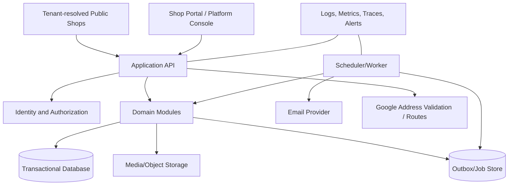

# 08 — Technical Architecture and API

## 1. Architecture goals

- Technology-neutral separation between public presentation, administration, application logic, persistent data, and background processing.
- Strong transactional consistency for orders and capacity.
- Replaceable integrations for email, future payment, geocoding, messaging, and authentication.
- A modular monolith is appropriate for MVP; module boundaries must remain explicit so scale-out does not require rewriting domain rules.
- Tenant isolation is a first-class security boundary from the first schema/migration, even when only one shop is initially active.

## 2. Component view



Domain modules: Tenancy/Entitlements, Catalog/Media, Availability, Orders/Sources, Customers/Areas, Fulfillment/Delivery, Payments-recording, Suppliers/Quality/Purchases, Expenses, Staff Picking/Earnings, Reporting/Analytics/Exports, Invoices/Documents, Reviews, Pickers, Contact, Channels/Shared Inbox/Campaigns, CMS, IAM, Notifications, Settings, Audit.

## 3. Application boundaries

- Public read APIs expose only published/localized content and safe availability.
- Public command APIs accept form submissions under strict rate limits and validation.
- Shop-portal APIs require authenticated permission checks per operation.
- Domain services own status transitions, capacity calculations, delivery pricing, matching, and audit emission. Controllers/UI must not reproduce these rules.
- Background workers call the same domain services as interactive users.
- Public host/slug resolution establishes tenant context before any content, catalog, form, media, or analytics operation. Authenticated tenant context comes from verified membership, never a freely trusted request parameter.
- Platform Admin console is separated from shop portal routes and platform controls. In explicit selected-shop context, Platform Admin inherits all Manager shop commands with visible context and audit attribution.

## 4. Representative API surface

Exact HTTP/GraphQL style is an implementation choice. Commands should use typed request/response contracts and stable error codes.

Delivery quoting uses `DELIVERY_ADDRESS_CONFIRMATION_REQUIRED` for a correctable provider suggestion, `DELIVERY_QUOTE_STALE` for an expired/version-mismatched signed quote, and a successful `DELIVERY_TO_BE_AGREED` fee state—not a fatal order error—for beyond-limit/no-route/provider-failure fallback.

Effective Google delivery is `platform_google_delivery_enabled && shop_google_delivery_enabled && credentials_ready && origin_validated && provider_circuit_available`. A false value short-circuits before any Google Address Validation/Routes call, returns `DELIVERY_TO_BE_AGREED` with internal cause `PROVIDER_DISABLED` where applicable, and invalidates unconsumed automatic quotes. Public responses never disclose the internal disabled/failure cause.

### Public reads and commands

```text
GET  /public/pages/{slug}?locale=fi
GET  /public/products?date=YYYY-MM-DD&locale=fi
GET  /public/availability?product_id=...&package_id=...
POST /public/delivery-quotes
POST /public/orders
POST /public/reviews
POST /public/picker-applications
POST /public/contact-messages
GET  /public/order-receipts/{opaque_reference} (optional short-lived access design)
POST /public/analytics/events
GET  /public/media/{tenant-safe-reference}
```

Avoid exposing personal details through a guessable order-reference endpoint. Prefer returning the receipt in the successful command response or a signed short-lived token.

### Shop-portal resources/commands

```text
GET/POST/PATCH /admin/orders
POST /admin/orders/{id}/transitions
POST /admin/orders/{id}/contact-attempts
POST /admin/orders/{id}/payment-records
GET/POST/PATCH /admin/customers
POST /admin/customers/{id}/anonymize
GET/POST/PATCH/DELETE /admin/products
GET/POST/PATCH /admin/packages
GET/PUT /admin/availability/{product}/{date}
POST /admin/availability/{product}/batch
GET/POST/PATCH /admin/pickup-locations
GET/POST/PATCH /admin/delivery-rules
GET/POST/PATCH /admin/delivery-origins
GET/PATCH /admin/settings/delivery-provider
GET/POST/PATCH /admin/reviews
GET/PATCH /admin/picker-applications
GET/PATCH /admin/contact-messages
GET/POST/PATCH /admin/cms/pages
POST /admin/cms/pages/{id}/publish
GET/POST/PATCH /admin/users|roles
GET/PATCH /admin/settings
GET /admin/dashboard
GET/PATCH /admin/notifications
GET/POST/PATCH /admin/suppliers
GET/POST/PATCH /admin/external-purchases
GET/POST/PATCH /admin/expenses
GET/POST/PATCH /admin/picking-entries
POST /admin/picking-entries/{id}/submit|approve|reject|mark-paid
GET/POST/PATCH /admin/compensation-rates
GET /admin/reports/weekly|financial|operations
POST /admin/report-exports
POST /admin/orders/{id}/invoices/preview|issue
GET /admin/invoices/{id}/pdf
GET/POST/PATCH /shops/{shop}/order-sources
GET/POST/PATCH /shops/{shop}/customer-areas
GET/POST/PATCH /shops/{shop}/quality-grades|external-buy-rates
POST /shops/{shop}/orders/{id}/documents/order-summary
GET/POST/PATCH /shops/{shop}/channel-connections
GET/POST/PATCH /shops/{shop}/channel-content|segments|campaigns
POST /shops/{shop}/campaigns/{id}/schedule|cancel|dispatch
GET/PATCH /shops/{shop}/inbox/conversations
POST /shops/{shop}/inbox/conversations/{id}/messages
POST /webhooks/channels/{provider}
GET/POST/PATCH /platform/shops
POST /platform/shops/{id}/suspend|reactivate|select-context
GET/PATCH /platform/settings/delivery-provider-kill-switch
```

## 5. Public order transaction

Within one transaction or an equivalent strongly consistent unit:

1. Validate idempotency key and return prior success if already committed.
2. Load active product/package/date, validate the product window and effective sold-out state, and lock or condition capacity/version.
3. Before opening the database transaction, resolve effective provider enablement. If enabled, validate/recompute any stale quote server-side through Google; if disabled, make no Google delivery call and produce `DELIVERY_TO_BE_AGREED`. Inside the transaction, verify the quote's signed destination/origin/rule/enablement binding and recompute litres, prices, distance classification, fee, and total; disabled/beyond-limit/unverifiable/no-route/provider-failure delivery keeps fee/final total null pending agreement.
4. Reject if remaining capacity is insufficient or ordering is closed.
5. Match/create or provisionally associate customer using normalized identifiers and ambiguity/conflict rules.
6. Create order and item/customer/fulfillment/price snapshots.
7. Add capacity movement/reserved litres.
8. Add status history/audit and notification outbox event.
9. Commit.

Email/in-app distribution occurs after commit from the outbox; notification failure must not roll back a valid order.

Use stable machine codes: return `SOLD_OUT` when the effective state is already naturally or manually sold out, and `CAPACITY_CHANGED` when a stale/racing submission loses positive capacity before commit. Both map to localized public text and expose neither configured capacity nor the internal override cause.

## 6. Capacity concurrency patterns

Acceptable implementations include:

- Row lock on the product/date availability row, followed by invariant check and movement insert.
- Setting/clearing manual sold-out and order submission use the same availability version/lock boundary, so a committed sold-out override prevents later orders and races cannot create partial effects.
- Capacity commands may target the current business date after cutoff as well as future in-window dates. They reject historical dates and any value below reserved litres; saving capacity neither clears manual sold-out nor bypasses cutoff/order-acceptance state.
- Atomic conditional update such as “increment reserved only when reserved + requested <= capacity,” followed by checking affected row count.
- Serializable transaction with retry on serialization conflict.

An application-only “check then insert” without database concurrency control is not acceptable.

## 7. Idempotency and optimistic concurrency

- Public submit includes an idempotency key scoped to form/session; identical replay returns the committed response.
- Shop-portal mutation responses include version/ETag. Update with a stale version returns a conflict and current summary.
- State commands specify expected current status.
- Scheduled/outbox jobs have deterministic deduplication keys.

## 8. Localization and time

- Store UI/content translations by locale rather than duplicated product entities.
- Store instants in UTC; calculate business dates/times using the resolved shop IANA timezone, initially `Europe/Helsinki`.
- Store `fulfillment_date` as a business date independent of UTC timestamp.
- DST behavior must be covered by tests. The configured local 10:00/19:00 should occur once per business day.

## 9. Integration interfaces

- `EmailGateway`: administrative notification delivery and status callbacks where available.
- `IdentityProvider`: admin authentication, MFA, recovery, lifecycle.
- `MediaStorage`: signed upload, transformation, malware/type checks, public delivery.
- `AddressClassifier`: MVP postal-zone lookup; future geocoding/radius provider behind the interface.
- `PaymentGateway`: absent in MVP, but payment records include provider/reference fields for later implementation.
- `ChannelProvider`: capability discovery, connection lifecycle, Facebook Page publishing, Group manual-share metadata, WhatsApp template/window/send, inbound webhook normalization, and message status; future Instagram support implements the same interface.
- `VideoProvider`: validates and normalizes supported YouTube/Vimeo references; uploaded media uses `MediaStorage` and processing.
- `DocumentRenderer`: deterministic server-side PDF rendering for invoices and report exports, with versioned templates/fonts and checksum.
- `InvoiceDeliveryGateway`: interface/event boundary only in MVP; no automatic customer email delivery implementation.

## 10. Error model

Return correlation ID, stable code, localized/safe message, and field errors. Examples: `CAPACITY_CHANGED`, `DATE_CLOSED`, `INVALID_TRANSITION`, `STALE_VERSION`, `DELIVERY_AGREEMENT_REQUIRED`, `PERMISSION_DENIED`, `RATE_LIMITED`. Do not leak stack traces, database keys, or existence of protected records.

## 11. Deployment shape

At minimum: tenant-resolved public/shop/platform web surfaces, API/application service, worker/scheduler, relational database, object storage/CDN/media processing, PDF renderer, transactional admin email provider, channel webhook/connector boundary, secret manager, backups, and observability. Surfaces may share a deployment but must retain authorization and tenant boundaries.

## 12. Reporting architecture

- Source-of-truth transactions remain normalized and auditable; reports must not mutate them.
- Start with database views/read models or scheduled aggregates within the modular monolith. A warehouse is not required for MVP.
- Every metric has a formula version and business-date attribution rule.
- Aggregates support drill-down to permitted source records and reconciliation totals.
- Large CSV/PDF exports run asynchronously, are stored with short-lived authorized download links, and record requester/filter/data-cutoff metadata.
- External purchases and their linked expense facts share a canonical cost identity to prevent double counting.
- Invoice rendering consumes only an issued invoice snapshot, never mutable current customer/product/settings data.

## 13. Tenant isolation and future subscription path

- Shared database/schema with mandatory `tenant_id` is acceptable for MVP if database constraints, repository/query guards, authorization, cache/job keys, and automated isolation tests make tenant omission fail closed.
- High-risk financial/customer/channel queries should use tenant-aware repositories or database row-level security as defense in depth where supported.
- Platform Admin selected-shop access resolves an explicit tenant and emits durable audit. It inherits all Manager permissions for that shop plus platform permissions; normal shop users cannot select arbitrary tenant IDs.
- Tenant suspension is enforced at public writes, background sends, API, and provider dispatch—not only in UI.
- Plan/entitlement checks use stable capability keys and limits. MVP seeds one internal plan and permits Platform Admin assignment; future subscription/billing services update entitlement state through an interface.
- Do not build recurring billing, metered usage, trials, dunning, tax invoices for subscriptions, or self-service merchant onboarding in this MVP.

## 14. Channel/shared-inbox architecture

- OAuth/provider credentials are encrypted references and scoped to one tenant/connection.
- Provider webhooks are authenticated, deduplicated by provider event ID, routed through a verified account-to-tenant mapping, normalized, then committed with outbox events.
- Send pipeline performs consent/suppression/template/window/capability checks at queue and again at dispatch, writes one recipient state per attempt, and records provider delivery/read/failure callbacks.
- Scheduled campaigns use durable jobs and tenant-local timezone. Cancellation prevents undispatched recipients but cannot recall already accepted provider messages.
- Shared inbox stores provider-normalized threads/messages while retaining minimal raw metadata for diagnosis under restricted access/retention.
- Facebook Group MVP produces an approved content package/manual-share action. Future auto-publish is enabled only through connector capability discovery.

## 15. Funnel analytics architecture

- Use first-party, pseudonymous tenant-scoped sessions only after analytics preference allows it.
- Events contain stable event names and non-PII IDs; never send names, addresses, contact fields, notes, validation values, or order contents as free text.
- `FORM_ABANDONED` is a derived metric after session expiry, not a client event claiming intent.
- Operational order funnels use authoritative order/status history and remain separate from analytics-session funnels.
