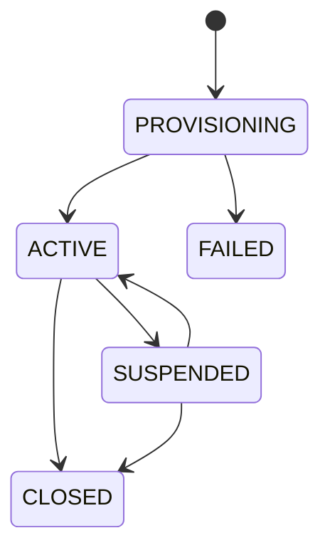

# 16 — Multi-tenant Platform and Shop Management

## 1. Product recommendation

METSÄNILO should be multi-tenant-ready in this MVP but should not implement full subscription SaaS commerce yet.

The costly part to retrofit later is tenant isolation: adding shop ownership to customers, orders, finance, media, jobs, exports, provider accounts and authorization after production data exists. That foundation belongs in MVP.

The parts that can safely wait are self-service merchant signup, monthly subscription payment, trials, plan checkout, metered usage, proration, subscription invoices/tax, dunning and automated closure. They introduce a second commerce system—the platform selling software to shops—and materially expand legal, financial, support and failure workflows.

## 2. MVP versus future SaaS

| Capability | MVP | Future commercialization |
|---|---:|---:|
| Tenant ID and enforced data isolation | Yes | Continue |
| Multiple shops supported by core | Yes | Continue |
| Platform Admin manual provisioning | Yes | May coexist |
| Manager/Staff/Content Editor memberships | Yes | Continue |
| Shop branding/slug/settings/catalog/operations | Yes | Continue |
| Platform entitlement/limit data structure | Yes | Billing drives it later |
| Self-service shop signup/onboarding | No | Yes |
| Monthly subscription checkout/renewal | No | Yes |
| Trials/coupons/proration/dunning | No | Yes |
| Merchant subscription invoices/VAT | No | Yes |
| Usage metering and plan upgrades | No automated billing | Yes |

## 3. Tenant ownership boundary

Each shop exclusively owns:

- Public brand/domain/slug, CMS, product media and settings.
- Products, packages, availability, pickup/delivery, order sources and customer areas.
- Customers, consent evidence, orders, documents and reviews.
- Suppliers, quality grades/rates, purchases, expenses, picking earnings and reports.
- Users/memberships/shop roles, notifications, exports and audit.
- Facebook/WhatsApp connections, templates/content, segments, campaigns and inbox conversations.
- Analytics sessions/events and operational dashboards.

Platform-owned data includes Platform Admin grants, shop registry, platform providers/configuration, entitlement definitions, global security/audit and future subscription accounts.

## 4. Role model

### Platform Admin

- Creates/suspends/reactivates shops and assigns initial Manager.
- Manages platform-wide providers/security/entitlement definitions.
- In explicit selected-shop context, inherits every Manager permission/action; selected context is audited tenant safety, not reduced authority.
- Cannot be granted by a Manager.

### Manager

- Shop owner/operator with every shop-scoped application permission in assigned shop(s).
- Manages shop members/roles, operations, products/capacity/sold-out state, finance, content, integrations, reports, audit and settings.
- May perform every financial workflow action, including approving/paying a record they created/submitted.
- Cannot cross shop boundaries or change platform subscription/security services.

### Staff

- Employee/contractor membership in a shop.
- Receives operational permissions, including shop product records, bounded availability planning, and daily manual-sold-out control; may be allowed to send messages or manage selected data.
- May submit financial records but cannot approve them.

### Content Editor (Content Creator)

- Shop-scoped CMS/media plus product identity/localization/availability-window management. It cannot change package price, per-date capacity, or operational/financial data.

A person has one User identity and one or more TenantMemberships. Roles are attached to memberships so the same person can be Manager in Shop A and Staff in Shop B.

Every human Platform Console and shop-portal user must use MFA. Service identities are non-interactive and follow separate credential controls.

## 5. Shop lifecycle



- `PROVISIONING`: create isolated defaults and initial membership; public writes disabled.
- `ACTIVE`: shop functions allowed subject to entitlements.
- `SUSPENDED`: public writes and outbound sends blocked; data retained; permitted support/read access only.
- `CLOSED`: future offboarding/retention state; no immediate destructive cascade.

## 6. Shop provisioning flow

1. Platform Admin enters identity, stable key, public slug/host, defaults, primary Manager and entitlement placeholder.
2. System validates unique host/slug and creates tenant atomically or through a resumable provisioning workflow.
3. Seed tenant roles/settings, configurable order sources, default customer areas/quality templates only when explicitly chosen, CMS drafts and notification defaults.
4. Invite/activate primary Manager membership.
5. Run isolation/provisioning health checks, then activate shop.
6. Manager configures business-specific content/catalog/delivery/privacy/channels before public launch.

## 7. Tenant resolution and authorization

- Public request: verified host/domain or stable path slug resolves tenant before resource access.
- Authenticated shop portal: user selects from verified active memberships; session/token carries membership context.
- API identifiers are always checked against resolved tenant. Supplying another tenant’s object ID returns a non-enumerating denial/not-found.
- Workers/jobs/outbox messages carry tenant ID and fail closed if absent.
- Cache keys, storage paths, export files, analytics and provider connections are tenant-qualified.
- Platform support mode visibly shows shop and Platform Admin identity and records reason/action.

## 8. Entitlement design

Use stable capability keys such as:

```text
catalog.products.max
media.uploaded_video.enabled
media.storage_bytes.max
users.max
channels.facebook.enabled
channels.whatsapp.enabled
campaigns.enabled
reports.pdf.enabled
```

MVP assigns a platform-defined internal plan manually. Domain features ask an entitlement service whether a capability/limit is available. The service initially reads Platform Admin-managed records; a future subscription system becomes the writer without changing domain ownership.

Entitlement denial must not delete or hide retained historical data needed for compliance/support. It controls new actions and clearly explains remediation.

## 9. Isolation verification

Release-blocking tests include:

- Cross-shop object-ID access through every API and file/download route.
- Search, filters, autocomplete, exports and dashboard aggregates.
- Jobs, notifications, scheduled posts/messages and webhooks.
- Shared object storage/media path and signed URL scope.
- Cache pollution/key omission.
- Customer matching never crossing shops, even with same mobile/email.
- Provider account/webhook routing and inbox threads.
- Platform support context and audit.
- Shop suspension enforcement.

## 10. Future subscription integration

A future Subscription module may own MerchantAccount, Plan, Subscription, Trial, BillingCustomer, SubscriptionInvoice, PaymentAttempt and UsageMeter. It publishes entitlement changes to the tenant system. Shop-domain orders/customers/payments remain unrelated to the platform’s merchant subscription billing, avoiding accidental mixing of two financial domains.
