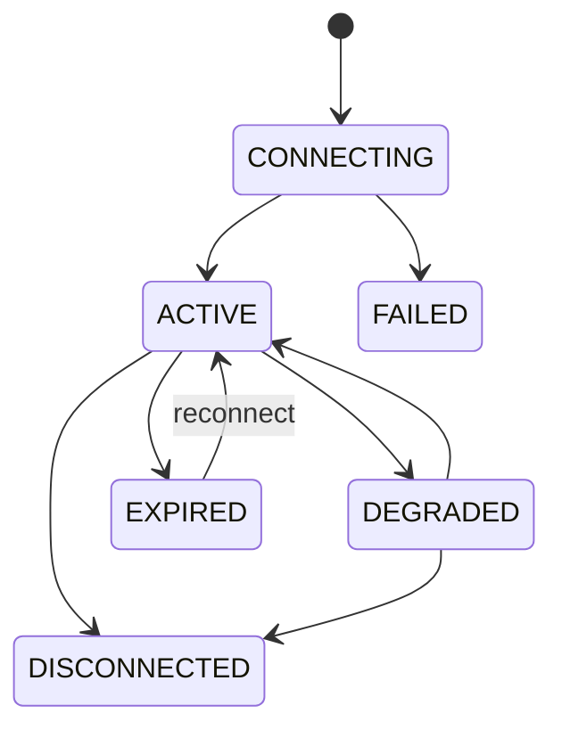

# 17 — Channels, Shared Inbox and Marketing Integrations

> **Deferred for v0.0.1 — ADR-0005.** Facebook, WhatsApp, shared inbox, broadcasts, campaign segments, channel consent, provider webhooks, and marketing automation are not implemented or required for the two-day pilot. Manual phone/other order source recording remains available.

## 1. MVP scope

- Provider-neutral shop channel connections.
- Facebook Page publish-now/scheduled posts.
- Facebook Group content preparation and manual-share action; auto-publish remains a future capability check.
- WhatsApp transactional and marketing messages using supported provider templates/windows.
- Inbound Facebook/WhatsApp replies/messages synchronized into a shared inbox where provider APIs allow.
- Customer matching/linking, assignment, tags, internal notes and replies.
- Customer segments, audience preview/exclusion, scheduled broadcasts and provider status tracking.
- One optional WhatsApp-only marketing checkbox in the initial public UI, with channel-specific backend evidence; later channels require separate approval and a new affirmative action.
- Future Instagram/provider adapters without Instagram implementation in MVP.

## 2. Capability-driven provider model

The domain asks the connector what the authorized account/provider version can do. Example capabilities:

```text
PUBLISH_PAGE_POST
SCHEDULE_PAGE_POST
PREPARE_GROUP_MANUAL_SHARE
PUBLISH_GROUP_POST (future; false in MVP unless explicitly supported)
SEND_FREEFORM_WITHIN_WINDOW
SEND_APPROVED_TEMPLATE
RECEIVE_MESSAGES
RECEIVE_STATUS_CALLBACKS
MEDIA_IMAGE
MEDIA_VIDEO
```

UI and backend both enforce capabilities. An unavailable function is labeled unsupported/manual, not presented as a send button that fails later.

## 3. Connection lifecycle



Connections are tenant-specific. OAuth state/account ownership/scopes are verified. Tokens are encrypted secret references. Manager or explicitly authorized Platform Admin connects/disconnects; Staff cannot obtain credentials.

## 4. Marketing consent model

The initial public UI contains one optional unchecked WhatsApp-only checkbox. Messenger or another direct-marketing channel is added only after separate enablement and legal/provider approval, with a new affirmative action, for example:

> I want to receive seasonal offers and news from {Shop Name} via WhatsApp. I can withdraw at any time.

Although the UI has one checkbox, granting it creates grouped evidence for each named channel. Evidence stores shop, purpose, channel set, locale, statement version, source and time.

Rules:

- Order submission never depends on marketing consent.
- Only channels literally named by the accepted statement are covered.
- Facebook Page publishing is not a customer direct-marketing channel and is never included in customer consent merely because the shop publishes Page posts.
- Adding Instagram later requires a new consent statement and affirmative action.
- Withdrawal can target all marketing channels from that evidence; channel-specific opt-out events may also be recorded from provider/user messages.
- Transactional order messages use a separate purpose and must not contain promotional content.
- Consent is necessary but not sufficient: provider template/window/policy, local law, suppression and frequency checks also apply.

## 5. Customer matching from channels

Match priority stays within the shop:

1. Exact normalized mobile/WhatsApp number.
2. Exact email where provided.
3. Exact stable provider-scoped Messenger/contact identifier.
4. Display name only produces a match suggestion.

Conflicts require Staff confirmation. An inbound contact may remain an unlinked ChannelContact; it must not silently overwrite customer data. Creating/linking a Customer is audited.

## 6. Shared inbox

### Thread status

`OPEN`, `PENDING`, `CLOSED`. Provider delivery/read status belongs to messages, not thread status.

### Functions

- Filter unread/channel/assignee/tag/customer/order/date/status.
- Assign to Manager/Staff, add internal note, link/unlink order/customer.
- Render supported text/media/document/reply context safely.
- Reply with free-form content only when provider window/capability permits; otherwise require an eligible approved template.
- Display queued/sent/delivered/read/failed where provider exposes them.
- Prevent internal notes from entering send pipeline.
- Record original provider IDs, timestamps and deduplication safely.

## 7. Social post workflow

`DRAFT → READY/SCHEDULED → PUBLISHING → PUBLISHED`, with `FAILED` and pre-dispatch `CANCELLED`.

Content includes locale, text, media/link, channel variants, target account, schedule, author, required permission/approval and provider result. Facebook Page uses connector publish. Facebook Group MVP produces copy/media/manual-share instructions/link and records “prepared/manual,” not “published,” unless user confirms the external manual outcome.

## 8. WhatsApp transactional messaging

Transactional messages are linked to a specific order/service purpose, such as confirmation manually initiated by an authorized user, delivery agreement, ready/pickup information, or a requested document link. MVP does not automatically attach/send invoice or Order Summary PDF merely because it was generated; a user explicitly chooses the message/action.

At send time validate recipient, provider account, customer/order relationship, template/window eligibility, locale, variables, document-link security/expiry and suppression rules.

## 9. Segments and marketing broadcasts

Allowed initial criteria:

- Customer area.
- Product/order history and date range.
- Order count or repeat-customer status.
- Fulfillment method.
- Configured order source.
- Channel availability and active marketing consent.
- Suppression/last marketing contact/frequency cap.

Do not segment using inferred sensitive traits, message content, or special-category data.

Campaign workflow:

1. Define/version segment.
2. Preview eligible/excluded counts and reasons.
3. Select approved marketing template/content/locale and schedule.
4. Re-evaluate audience/consent/suppression/template/capability at dispatch.
5. Create one idempotent recipient dispatch record.
6. Track provider statuses, failures and opt-outs.
7. Report delivered/read/failed only when provider semantics support them; never equate delivered with purchase.

## 10. Scheduling and safety

- Shop timezone drives schedule display; dispatch instant is UTC.
- Durable jobs survive restart and execute once per recipient.
- User may cancel unsent work; accepted provider messages cannot be recalled.
- Connection expiry/permission change/template rejection pauses or fails affected recipients with actionable reason.
- Frequency caps and optional quiet hours are shop-configured.
- Large broadcasts use rate-aware queues and do not block order operations.
- Test-send recipients are explicit and auditable.

## 11. Reporting

- Post: scheduled/published/manual-prepared/failed by channel/account.
- Inbox: inbound/outbound volumes, first-response time, open/pending/closed, assignment workload.
- Campaign: selected/eligible/excluded/queued/sent/delivered/read/failed/opted-out, with provider-semantic caveats.
- Conversion: store/link campaign/referrer IDs where present; campaign operational delivery results are MVP, while campaign-to-sales attribution report UI is deferred.
- All reports are tenant-scoped and permission-aware.

## 12. Privacy, retention and security

- Verify webhook signatures and deduplicate events.
- Encrypt/restrict credentials and provider contact identifiers.
- Apply data minimization and purpose-specific retention to message bodies/attachments/raw payloads.
- Do not put message content, customer identifiers or tokens in generic logs/analytics.
- Support opt-out/withdrawal immediately and maintain suppression evidence.
- Signed document/media URLs expire and require intended access controls.
- Disconnect revokes credentials but retains required auditable message history under policy.

## 13. Failure behavior

- Provider unavailable: queue remains retryable and status visible.
- Invalid/expired token: connection becomes degraded/expired and sends pause.
- Unsupported Facebook Group action: offer manual-share flow only.
- Template/window failure: recipient is excluded/failed with safe reason; no free-form workaround.
- Duplicate webhook/callback: no duplicate message/status history.
- Customer withdraws consent after schedule but before dispatch: marketing recipient is excluded.
- Tenant suspended: all public writes and undispatched channel work stop.

## 14. Provider-policy references

Provider behavior changes over time; implementation must confirm the current API version, app-review requirements, scopes, templates, pricing and policies before release:

- [Meta Graph API v19 changes](https://developers.facebook.com/blog/post/2024/01/23/introducing-facebook-graph-and-marketing-api-v19/)
- [Meta WhatsApp Business Platform API collection](https://www.postman.com/meta/whatsapp-business-platform/overview)
- [WhatsApp marketing-message best practices](https://whatsappbusiness.com/wp-content/uploads/2026/04/Best-Practices-for-Marketing-Messages-on-WhatsApp-.pdf)
