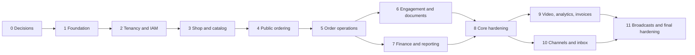

# 19 — Development Plan and Progress Tracker

> **Current release: v0.0.1 two-day pilot — ADR-0005 is authoritative.** The longer phase plan below remains the future roadmap. The pilot is intentionally limited to one shop, four roles with per-user permissions, core ordering/capacity/pickup, manual delivery fees, fixed-page four-image CMS, invoice/payment records, record-only pickers, and picking records in litres or kilograms with unit-specific buy prices. Customer orders/capacity remain litres-only.

Version: 2.0
Status: Approved plan; implementation not started  
Approved: 2026-08-13  
Market: Pori/Satakunta, Finland  
Initial locales: Finnish and English  
Currency: EUR  
Business timezone: `Europe/Helsinki`

## 1. Purpose and authority

This document converts the approved requirements into an implementation sequence and is the canonical development-progress tracker for the project.

Exact ownership of every requirement, rule, NFR, and acceptance scenario is maintained in [20 — Phase and Release Traceability](20-phase-and-release-traceability.md).

It does not replace functional requirements, business rules, form specifications, acceptance criteria, or non-functional requirements. If this plan conflicts with a more specific requirement, the more specific requirement wins until an approved decision record changes it.

No phase is complete merely because its UI exists. Completion includes the applicable domain behavior, database migration, authorization, validation, audit, observability, automated tests, accessibility, localization, documentation, and acceptance evidence. Tenant isolation, provider, and background-job gates apply only to future releases.

## 1A. v0.0.1 two-day execution plan

The pilot has **4 implementation phases**. They are intentionally smaller than the 12-phase future roadmap below.

| Phase | Timebox | Deliverable | Exit evidence |
|---|---:|---|---|
| P0 — Scope and foundation | Day 1, hours 0–3 | Single-shop schema, Admin/Manager/Staff/Content Creator auth, feature-permission catalogue, Finnish default + English switch, seed shop/admin, audit skeleton | Login/permission matrix and i18n smoke tests pass |
| P1 — Public catalog and order core | Day 1, hours 3–8 | Fixed-page CMS, product CRUD, max four images, availability window, per-day capacity/sold-out, pickup address/instructions, public order form, atomic reservation | Customer can submit pickup or delivery-to-be-agreed order without oversell |
| P2 — Operations and records | Day 2, hours 0–5 | Order list/status transitions, manual delivery fee, payment record, invoice PDF download, external picker records, litre/kg picking records with unit-specific buy prices, Manager permission assignment | Staff flow and Admin/Manager self-approval are audited and permission-tested |
| P3 — Release hardening | Day 2, hours 5–8 | Responsive/accessibility/i18n QA, image/file validation, error recovery, seed/demo data, deployment configuration, smoke tests, rollback notes | Critical acceptance subset passes and no Google/Meta API is required |

### Explicit v0.0.1 deferrals

Do not start multi-shop organisation, Platform Admin, Google Routes/Address Validation, postal zones, Facebook/WhatsApp/shared inbox, public picker applications, supplier purchases, expenses, quality/rates, staff compensation/payroll, full finance/reporting/export, customer accounts, automated email/SMS, video media, raw HTML/arbitrary CMS blocks, marketing consent/campaigns, or scheduler/outbox work until the pilot is live and verified.

## 1B. Current code versus approved v0.0.1 requirements

The repository is not an empty scaffold. The current code is a narrower working reservation pilot (`package.json` version `0.0.2`, current production history on `main`). It already provides:

- Finnish-default and English public routes with a language switch.
- Seeded one-shop product/package/catalog data.
- Atomic public order reservation with idempotency and concurrent-capacity protection.
- Litre-only customer orders, sold-out/remaining-capacity presentation, pickup address/instructions, and delivery always shown as “Delivery to be agreed.”
- A protected Manager view for basic capacity/sold-out/order operations.
- Turso/libSQL + Drizzle migrations, seed scripts, audit rows, and focused order tests.

The current code is still missing or deliberately narrower than the approved requirements:

| Approved capability | Current state before the next release |
|---|---|
| `ADMIN`, `MANAGER`, `STAFF`, `CONTENT_CREATOR` accounts | Basic Manager-only environment-password access; no user records or per-user permissions |
| Product module | Seed/configuration-driven product and package; no complete portal CRUD/media editor |
| Availability | Core daily capacity/sold-out behavior exists; full day/week/month/custom planner and complete UI remain |
| Order operations | Core submit/confirm/cancel exists; full order list/detail, payment record, manual delivery fee, invoice workflow remain |
| CMS and four-image media | Not implemented; public pages are code/configuration-driven |
| External picker records | Not implemented |
| Picking records | Not implemented; target is litre/kg quantity plus unit-specific buy price |
| Invoice PDF | Not implemented; tax/VAT wording remains intentionally neutral |
| Production hardening | Core scripts exist, but the local dependency installation currently lacks `vitest`; typecheck therefore fails until dependencies are installed from the lockfile |

This gap review is the baseline for the nine releases below. It does not authorize expanding v0.0.1 beyond the approved pilot boundary.

## 1C. Nine deployable release increments

The detailed release decision is [ADR-0006](decisions/0006-incremental-deployable-release-plan.md). There are **nine** checkpoints: `v0.0.2`, `v0.0.3`, `v0.0.4`, `v0.0.5`, `v0.0.6`, `v0.0.7`, `v0.0.8`, `v0.0.9`, and `v0.1.0`.

| Version | Scope | Deployable acceptance gate |
|---|---|---|
| `v0.0.2` | Foundation hardening: Turso/Vercel reproducibility, env validation, migration/seed safety, errors, smoke tests | Existing public order/pickup/delivery pilot still works after a clean migration and production smoke test |
| `v0.0.3` | Product CRUD: localized product/package management, availability window, archive/delete checks | Admin/Manager/assigned Staff/Content Creator can update catalog without breaking public ordering |
| `v0.0.4` | Capacity operations: day/week/month/custom planning, current-day edits, sold-out controls | Concurrent reservations remain safe; public remaining litres/sold-out behavior remains correct |
| `v0.0.5` | Order operations: list/detail, notes, transitions, payment records, manual delivery fee | Staff can operate an order end-to-end; delivery remains manual and audited |
| `v0.0.6` | Identity/RBAC: four roles, user records, feature permissions, Manager assignment | Unauthorized UI and API actions are denied; existing Manager flow is preserved |
| `v0.0.7` | Fixed-page CMS and media: fi/en draft/publish/preview/revisions, maximum four images | Public content can be changed without code and remains accessible in both locales |
| `v0.0.8` | Picking/invoices: external picker records, litre/kg quantities, `€/L`/`€/kg` buy prices, invoice PDF | Authorized user records, approves, pays, and downloads correct unit-specific picking/invoice facts |
| `v0.0.9` | Hardening: accessibility, i18n completeness, API authorization, audit, media limits, backup/rollback/runbook | Critical journeys pass release QA and preview deployment checks |
| `v0.1.0` | Pilot launch: real data/configuration, tax-neutral invoice wording, production verification | All previous gates pass in production; tag and rollback reference are recorded |

Every version is a working deploy, not a partial feature branch. A version may be merged/tagged only after typecheck, lint, tests, build, migration verification, locale smoke checks, and the version-specific acceptance gate pass.

### v0.0.2 detailed work plan

**Goal:** harden the existing v0.0.1 pilot for repeatable Vercel/Turso deployment without adding a business feature.

| Workstream | Tasks | Exit evidence |
|---|---|---|
| Configuration | Split local/test defaults from production requirements; validate URL, auth token, shop/pickup/timezone, and Manager credentials; reject unsafe production fallback values | Invalid production configuration fails before serving traffic with an actionable message |
| Database operations | Add migration preflight, explicit failure handling, idempotent seed safeguards, and disposable libSQL migration/seed test | Clean database can migrate and seed; existing reservations are never reset |
| Runtime reliability | Add safe health/readiness endpoint, release/commit metadata, stable correlation IDs, and structured redacted error logging | Health reports configuration/database readiness without secrets or PII |
| Deployment | Verify clean `npm ci` path, Vercel/Turso variable matrix, preview/prod procedure, rollback and migration runbook | Preview and production deployment can be repeated by another operator |
| Regression | Add smoke checks for locale, privacy, order, idempotency, capacity, sold-out, pickup, delivery pending, Manager auth, and status mutation | Existing v0.0.1 journey passes in Finnish and English |

**Out of scope:** Product/CMS/RBAC/payments/invoices/pickers/picking units and all deferred integrations.

**Planned commits:** `chore(v0.0.2): harden runtime environment validation`; `chore(v0.0.2): make migration and seed preflight-safe`; `feat(v0.0.2): add health and release metadata endpoints`; `test(v0.0.2): add deployment and smoke regression coverage`; `docs(v0.0.2): add deployment runbook and release notes`.

### v0.0.3 detailed work plan — Product module

**Branch rule:** implementation must start only after switching to `codex/release-v0.0.3`. The branch has been created before implementation; no v0.0.3 code is written yet.

**Goal:** provide a protected product/package CRUD module while preserving the v0.0.2 public reservation flow.

| Workstream | Tasks | Exit evidence |
|---|---|---|
| Schema | Add localized descriptions and archive/update metadata through an additive Drizzle migration; preserve existing snapshots | Disposable migration succeeds and existing order/catalog rows are unchanged |
| Domain/API | Implement list/create/update/activate/archive/delete commands for products and packages; validate both locales, code/slug, dates, litres, and price server-side | Invalid and unauthorized mutations are rejected with stable errors; audit rows are written |
| Reference safety | Check orders/reservations/retained facts before deletion; allow hard delete only when unreferenced, otherwise archive/deactivate | Referenced delete is refused; historical order snapshots remain unchanged |
| Manager portal | Add product/package list and bilingual create/edit/archive/delete forms with accessible validation and confirmation | Manager can manage catalog without editing code or seed variables |
| Public regression | Reuse catalog query; active/window-valid records remain orderable and archived records disappear from public ordering | Finnish and English order smoke tests pass |

**Release boundary:** v0.0.3 uses the existing Manager authentication gate. The `ADMIN`/`MANAGER`/`STAFF`/`CONTENT_CREATOR` permission assignments are implemented in v0.0.6. Media uploads belong to v0.0.7; capacity planning belongs to v0.0.4.

**Planned commits:** `feat(v0.0.3): add product description and archive schema`; `feat(v0.0.3): add product and package domain commands`; `feat(v0.0.3): add protected product module routes and portal`; `test(v0.0.3): cover catalog validation and reference safety`; `docs(v0.0.3): add product release notes and smoke checks`.

### Branch and tag cadence

Keep `main` production-approved. For each increment create `codex/release-v0.0.x` (or `codex/release-v0.1.0`), make small commits, deploy a preview, merge, tag the merge commit, and deploy the tag. Do not mix the next version’s unfinished work into a release branch. Suggested commits are `feat(v0.0.3): ...`, `test(v0.0.3): ...`, and `docs(v0.0.3): ...`.

## 2. Approved scope interpretations

- User-facing `Admin` means the single-shop `ADMIN` owner and has every shop permission.
- `MANAGER` is an employee with operational authority and may assign feature permissions to Staff and Content Creator; it cannot grant Admin.
- Staff receives sensitive capabilities only through explicit permissions. Quality/rate configuration is denied by default.
- MFA is required for every shop-portal and platform-console user.
- Historical orders may represent every legitimate terminal outcome. A historical refund preserves the completed-sale and refund chronology rather than creating an unexplained bare refund.
- Public MVP ordering has one item line with fixed quantity 1; manual/historical orders may have multiple lines and positive integer quantities under one fulfillment date/method.
- Conflicting public customer identifiers create a provisional review record rather than an automatic link or merge.
- Outside/unverifiable delivery keeps the item subtotal authoritative while delivery fee/final total remain pending until agreement.
- Delivery is always “Delivery to be agreed.” No Google, postal-zone, route, or provider setting is implemented. Admin/Manager/Staff with `delivery.override` can enter a fee and reason.
- Partial refunds retain completed fulfillment status; only a full cumulative refund transitions the order to `REFUNDED`.
- `CUSTOMER_DECLINED` resolves the 15-minute overdue-new condition.
- External purchases use `DRAFT → SUBMITTED → APPROVED → PAID`, with rejection/correction controls and complete action-level audit.
- Admin and Manager may self-approve/pay invoice/payment/picking records; Staff requires explicit permission. No Finance Approver/External Accountant portal role is introduced.
- Admin, Manager, Staff, and Content Creator manage products according to feature permissions. Admin/Manager/Staff manage bounded day/week/month/custom capacity; Content Creator may manage content/product identity only when assigned.
- Admin, Manager, and Staff may set a private daily manual-sold-out override. Public UI shows the same sold-out state as natural exhaustion and reports remain truthful.
- External pickers are record-only; picking entries store person/product/date/litres. Full finance and compensation are deferred.
- Facebook/WhatsApp, shared inbox, and marketing automation are deferred.
- Open business, legal, accounting, privacy, infrastructure, and provider decisions are Phase 0 decision gates. Provisional values may be configurable in non-production environments, but affected capabilities cannot pass their production gate without owner approval.

## 3. Delivery model

The plan contains **12 phases**, numbered Phase 0 through Phase 11.

| Milestone | Included phases | Intended outcome |
|---|---|---|
| **v0.0.1 Pilot** | P0–P3 above | One-shop live pilot with core ordering and operations in two days |
| Core Operational Release | 0–8 | Secure multi-tenant public ordering and shop operations, including management finance/reporting |
| Extended MVP Release | 9–11 | Uploaded video, analytics, compliant invoices, Meta channels, shared inbox, segments, and scheduled broadcasts |

Phases 0–5 are sequential foundations. Phases 6 and 7 may overlap after Phase 5 is stable. Phase 8 certifies the core release. Phases 9 and 10 both depend on Phase 8 and may run in parallel; Phase 11 depends on both.

## 4. Technical baseline

- TypeScript modular monolith.
- Next.js App Router/TypeScript for the single-shop public site and admin portal.
- First-class internationalization with locale-prefixed routes, server-loaded translation dictionaries, Finnish default, English switch, and locale-aware content/formatting.
- Turso/libSQL with Drizzle and database-enforced atomic capacity reservation and versioned migrations.
- Durable jobs/outbox are future scope; do not make them a v0.0.1 dependency.
- Managed OIDC authentication with mandatory MFA.
- S3-compatible object storage in an approved EU region.
- Typed command/query contracts and stable error codes.
- Server-side deterministic PDF rendering with embedded Unicode-capable fonts.
- Unit/property, database/integration, API-contract, browser E2E, accessibility, security, performance, and recovery testing.
- Structured logs, metrics, traces, correlation IDs, alerts, encrypted backups, and restore rehearsals.

Final providers, hosting services, and the precise test runner require an architecture decision record before their related implementation starts.

## 5. Finnish-market UI/UX research and design direction

### 5.1 Research conclusion and limits

There is no reliable basis for claiming that all Finnish people prefer one colour, font, or visual style. The direction below combines recurring principles in Finnish design institutions and public digital systems, then requires usability validation with actual target users in Pori/Satakunta.

The evidence supports:

- Practicality, functionality, user consideration, equality, and solution-focused design as recurring Finnish design principles.
- A simple, honest, transparent visual language with room for an occasional distinctive or playful detail.
- A light neutral base and restrained use of colour for essential actions and information in public Finnish digital services.
- Minimal navigation, concise labels, visible hierarchy, and responsive/mobile behavior.
- Clear, readable type and accessibility as part of design quality rather than a later compliance layer.
- Nature as a credible source of visual identity for a local berry business.
- Bold colour and large-scale graphic expression as an authentic second strand of Finnish design, used here as a controlled accent rather than visual noise.

Finland has extensive mobile connectivity and mobile data use, so the experience remains mobile-first even though fast-network availability must not be used as permission for heavy pages or media.

### 5.2 Product design concept

The working concept is **Quiet Nordic utility + vivid berry moments**.

The public experience should feel:

- Local, fresh, calm, trustworthy, and direct.
- Modern without looking like a generic technology dashboard.
- Warm enough for seasonal food and human pickup/delivery.
- Operationally clear: product, price, package, remaining availability, date, fulfillment, and order action appear before decorative storytelling.
- Distinctive through photography, berry colour, typography, and small organic details—not through excessive animation, glass effects, or ornamental clutter.

The shop portal should use the same brand family but prioritize scan speed, status clarity, tables, filters, and evidence dialogs over decorative expression.

### 5.3 Proposed colour system

These are candidate tokens for prototype and contrast testing, not permission to encode meaning by colour alone.

| Token | Candidate | Intended use |
|---|---:|---|
| Snow | `#F7F7F2` | Main warm-neutral background |
| Surface | `#FFFFFF` | Cards, dialogs, forms |
| Ink | `#17201B` | Primary text |
| Muted ink | `#56625C` | Secondary text after contrast verification |
| Border | `#CCD4CE` | Dividers and input borders |
| Forest | `#14532D` | Primary brand/action colour |
| Forest dark | `#0F3F23` | Hover/active states |
| Bilberry | `#343A75` | Secondary accent, availability/data emphasis |
| Lingonberry | `#7D2444` | Seasonal accent and high-attention editorial moments |
| Harvest | `#A85E00` | Limited/warning emphasis; not body text on light backgrounds without verification |
| Focus blue | `#005FCC` | Strong, consistent keyboard focus indicator |

Rules:

- Neutral surfaces dominate; accents guide attention.
- Forest is the main transactional colour. Berry colours are accents, not competing primary buttons.
- Status always includes text and, where useful, an icon or shape; colour is never the only signal.
- All text, icons, controls, charts, focus states, disabled states, and hover combinations must be measured against WCAG 2.2 AA; critical text/control combinations should exceed the minimum where practical.
- Use real product photography with natural light and honest colour. Avoid generic Nordic stock imagery and overly cool blue filters that make food feel less fresh.
- Any pattern should be subtle, original, and nature-derived. Do not imitate protected Marimekko patterns or the official Finnish flag/identity.

### 5.4 Proposed typography

Candidate pairing:

- **Headings and selected display text:** Finlandica Headline, self-hosted and subset where licensing/build review permits. It is an open-source Finnish identity typeface with clear support for Finnish characters.
- **Body copy, UI, forms, tables, and numbers:** Source Sans 3, self-hosted. It is open source and used by the Suomi.fi Design System for readable public-service interfaces.
- **Fallback:** system sans-serif stack that preserves layout and Finnish diacritics.

Typography rules:

- Body text defaults to 18 px on public content and never below 16 px for normal UI text.
- Use a comfortable line height around 1.5–1.65 for body copy and keep reading lines roughly 45–75 characters.
- Use Finlandica Headline sparingly; dense operational screens use Source Sans 3 for maximum legibility.
- Reserve no more than three font weights per family in the initial web payload.
- Use real text, semantic headings, tabular numerals for financial/operational tables, and locale-correct Finnish date, decimal, currency, and time presentation.
- Test Finnish words, long compound words, English translations, names with diacritics, zoom, and narrow mobile layouts before locking the scale.

### 5.5 Layout, components, motion, and content

- Use an 8 px spacing foundation with generous whitespace and consistent density variants for public versus operational screens.
- Public navigation stays shallow: clear header, one primary order action, main content, and footer. Avoid a mega-menu for the small public information architecture.
- Mobile order controls remain within thumb reach where this does not obscure content or accessibility; the final price/availability/action summary may become sticky after testing.
- Cards use modest corner radii and subtle borders; avoid deep shadows, excessive pills, glassmorphism, and nested-card clutter.
- Forms use persistent visible labels, helpful examples, grouped fields, a focusable error summary, and preserved input after errors.
- Motion is short and purposeful, respects `prefers-reduced-motion`, and never delays a transaction or status confirmation.
- Finnish copy should be plain, concise, and concrete. English is localized rather than mechanically mirroring Finnish sentence structure.
- Trust content should show the real people, produce, pickup context, cleaning/handling process, location, and transparent pending-confirmation model.

### 5.6 Required user validation

Research-informed styling remains a hypothesis until tested. Phase 0/1 must validate it with target users.

- Recruit at least 5–8 Finnish-speaking participants from the target region or closely matching customer profile for the first formative round; include mobile users and varied ages/digital confidence.
- Compare at least two high-fidelity mood directions: the proposed restrained nature/berry direction and a cleaner blue/white civic-modern alternative.
- Test the Home-to-Order path, availability comprehension, pending-reservation wording, delivery-fee understanding, locale switching, and visual trust.
- Measure task completion, critical misunderstanding, time on task, error recovery, perceived trust/freshness, and stated preference with reasons.
- Conduct a second validation round after correcting material issues. Do not select a direction from preference voting alone; task success and comprehension have priority.
- Record findings and the final token/type decision in an architecture/design decision record.

### 5.7 Internationalization architecture and acceptance

Internationalization is a cross-cutting platform capability, not a final translation task.

#### Initial locale policy

- The initial supported content languages are Finnish (`fi`) and English (`en`).
- Finnish is the initial shop's default language.
- Public URLs use explicit locale prefixes and localized slugs backed by stable internal route identifiers, for example `/fi/tilaa` and `/en/order`, so links are deterministic, shareable, indexable, and unambiguous.
- A visit without a locale uses the visitor's previously explicit language choice when available; otherwise it resolves to the shop default (`fi`). Browser language may inform a non-blocking suggestion but does not silently override the approved Finnish default.
- The language switch is visible and keyboard accessible on every public page. It opens the equivalent page in the other language, preserving safe query/filter state and in-progress form values where technically safe.
- An anonymous visitor's explicit choice is stored in a necessary preference cookie. An authenticated portal user's preference is stored on their profile/membership and applied after login.
- Shop-supported languages and default language are data/configuration, not hard-coded assumptions, so another tenant can enable a different approved set later.
- Swedish and other future locales are architecturally supported but deferred from the MVP until content and operational ownership are approved.

#### What must be localized

- Public, shop-portal, and Platform Console navigation, labels, buttons, instructions, validation errors, empty/loading/error/success states, accessibility labels, and confirmation dialogs.
- CMS pages, announcements, product/package presentation, media captions/alternative text, pickup/delivery instructions, order-source labels, customer-area labels, quality descriptions, and configurable public messages.
- SEO metadata, page titles/descriptions, Open Graph text, structured data where language-sensitive, canonical URLs, `hreflang` alternates, sitemap entries, and the document `<html lang>` value.
- On-screen notifications and supported email copies.
- Order receipts, Order Summary PDFs, Invoice PDFs, report headings/footnotes, and explicitly composed channel content/templates. Each generated document stores its locale and template version.
- Locale-sensitive dates, times, numbers, litres, EUR values, pluralization, and list formatting using standards-based `Intl` behavior: initially `fi-FI` and `en-FI`, with EUR and `Europe/Helsinki` business semantics in both. Business calculations remain canonical and independent of display locale.

Customer-entered reviews, notes, messages, names, and other user-generated content are displayed in their original language and are never silently machine-translated.

#### Translation storage and fallback

- Application UI uses stable, namespaced translation keys and typed/validated dictionaries loaded for the requested locale. Business logic and persisted status values use stable language-neutral codes.
- APIs return stable error/status codes and structured parameters; presentation layers select the localized message. Logs and analytics use stable codes, not translated labels.
- Shop-owned localized entities use a translation structure keyed by locale rather than duplicate product/order entities. Adding a locale must not require redesigning core commerce tables.
- Missing application translation keys fail CI/build validation; production must never show raw translation keys.
- The initial METSÄNILO public launch requires complete Finnish and English critical journeys.
- CMS/catalog publishing validates all required fields in every enabled public locale. Any future per-shop fallback must be an explicit Manager-approved policy, visible in preview, and must never fabricate translated content.
- Commercial and historical order snapshots store the customer-visible localized labels used for that order, as well as stable source identifiers where required for reporting.

#### Implementation direction

- Use the Next.js App Router locale segment pattern such as `app/[lang]/...`, with server-side locale validation and dictionaries. The final library choice is recorded in Phase 0; framework-independent domain modules must not depend on that library.
- Load only the active locale's resources and keep large dictionaries out of unnecessary client bundles.
- Centralize locale resolution, supported-locale validation, route generation, formatter construction, and language-switch behavior; individual pages must not implement their own locale rules.
- Separate interface translations from editable CMS/catalog translations and from provider-managed message templates.

This follows the current [official Next.js internationalization guidance](https://nextjs.org/docs/app/guides/internationalization), which documents locale route segments, server-loaded dictionaries, locale validation, and language-specific static rendering.

#### Required i18n tests and release gates

- Every public and critical portal route renders in `fi` and `en`, declares the correct language, and retains locale during navigation, authentication, errors, and redirects.
- Root/no-locale routing honors an explicit saved choice and otherwise selects Finnish for the initial shop.
- Switching languages preserves the equivalent route and does not submit, clear, or corrupt an in-progress form.
- Translation-key parity, interpolation variables, plural forms, rich-text safety, and missing-key behavior are tested automatically.
- Finnish compound words, English expansion, Unicode names, long labels, 200% zoom, 320 CSS px reflow, PDFs, emails, tables, charts, and dialogs are visually and accessibly verified.
- Dates, times, decimal separators, EUR, litres, ISO-week labels, and `Europe/Helsinki` business-time semantics are verified independently in both display languages.
- Public SEO tests verify localized canonical/alternate links, metadata, sitemap entries, and absence of duplicate or mixed-language pages.
- No phase containing customer- or staff-facing UI can be marked complete until its Finnish and English states meet the phase acceptance criteria.

### 5.8 Research sources

- [Finland Toolbox: Finland as a design country](https://toolbox.finland.fi/arts-design/finland-a-design-country/) — practicality, functionality, user consideration, equality, and Scandinavian minimalism.
- [Suomi Finland Identity Guidelines 2025](https://toolbox.finland.fi/wp-content/uploads/sites/2/2025/04/finland_identity_guidelines_2025.pdf) — functional/transparent visual identity and the open-source Finlandica Headline/Text family.
- [Suomi.fi Design System: colours](https://designsystem.suomi.fi/styles/colors/) — light neutral presentation, restrained accent use, and accessible colour combinations.
- [Suomi.fi Design System: typography](https://designsystem.suomi.fi/styles/typography/) and [body text guidance](https://designsystem.suomi.fi/components/text/) — Source Sans 3, open licensing, and readable public-service type sizing.
- [Suomi.fi Design System](https://designsystem.suomi.fi/) — reusable components tested against WCAG 2.2 A/AA.
- [Helsinki Design System navigation examples](https://hds.hel.fi/patterns/navigation/examples/) — minimal navigation, clear hierarchy, responsive behavior, and multilingual accessibility.
- [Helsinki Design System header accessibility](https://hds.hel.fi/components/header/accessibility/) — keyboard/screen-reader ordering and avoiding unnecessary navigation clutter.
- [Marimekko story](https://www.marimekko.com/us_en/m/our-world/our-story) — Finnish precedent for bold colour and optimistic large-scale expression; used as contextual evidence, not as a pattern to copy.
- [Traficom: development of Finnish mobile networks](https://tieto.traficom.fi/en/statistics/development-finnish-mobile-networks) — current Finnish mobile coverage, subscription, and data-use context.
- [Next.js: Internationalization](https://nextjs.org/docs/app/guides/internationalization) — official App Router guidance for locale routing, dictionaries, locale validation, and rendering.

## 6. Progress tracking

Status values: `NOT STARTED`, `IN DISCOVERY`, `READY`, `IN PROGRESS`, `BLOCKED`, `IN VALIDATION`, `COMPLETE`.

| Phase | Name | Status | Progress | Required predecessor | Evidence/notes |
|---:|---|---|---:|---|---|
| 0 | Decisions, architecture, and design validation | IN DISCOVERY | 25% | — | Requirements audits, design research, i18n design, baseline decisions, and traceability completed; external owner gates remain |
| 1 | Repository and platform foundation | NOT STARTED | 0% | Phase 0 ready gate | — |
| 2 | Identity, permissions, and audit | NOT STARTED | 0% | Phase 1 | Single-shop pilot uses Admin/Manager/Staff/Content Creator; multi-tenancy deferred |
| 3 | Shop configuration, catalog, fixed-page CMS, and fulfillment setup | NOT STARTED | 0% | Phase 2 | Four-image CMS and manual delivery only for pilot |
| 4 | Customers, public ordering, and atomic capacity | NOT STARTED | 0% | Phase 3 | — |
| 5 | Order operations, lifecycle, payment records, invoice PDF, and picking | NOT STARTED | 0% | Phase 4 | Manual transitions; picker records and litre/kg picking records in pilot |
| 6 | Operational engagement and order documents | NOT STARTED | 0% | Phase 5 stable | May overlap Phase 7 |
| 7 | Supply, expenses, staff earnings, and reporting | DEFERRED | 0% | Phase 5 stable | Future release; pilot keeps only payment/invoice/picking records |
| 8 | Core release hardening and production readiness | NOT STARTED | 0% | Phases 6–7 | Core release gate |
| 9 | Uploaded video, analytics, and invoice completion | NOT STARTED | 0% | Phase 8 | Policy/accounting decisions required; may overlap Phase 10 |
| 10 | Channel connections, social publishing, and shared inbox | NOT STARTED | 0% | Phase 8 | Meta/BSP approval required; may overlap Phase 9 |
| 11 | Segments, broadcasts, and final MVP hardening | NOT STARTED | 0% | Phases 9–10 | Extended MVP release gate |

Progress percentages are evidence-based, not time-spent estimates. Update a phase only when its tracked deliverables and gates have corresponding issue, test, decision, or acceptance evidence.

## 7. Phase plan

### Phase 0 — Decisions, architecture, and design validation

Objective: make the requirements implementation-ready and remove architectural ambiguity.

Deliverables:

- Architecture decisions for repository shape, modules, Turso/libSQL + Drizzle migrations, API contracts, authentication/MFA, storage/media, PDFs, observability, hosting, and testing.
- Internationalization decision covering route strategy, locale resolution/persistence, dictionary tooling, translation ownership/workflow, CMS/catalog translation storage, fallback rules, SEO, formatting, and locale addition.
- Domain/module ownership map and initial migration sequence.
- Stable permission catalogue and threat model.
- Permission inheritance proving complete Manager shop authority and Platform Admin = Manager-in-selected-shop plus platform shop-management authority.
- Privacy/data inventory and processor decision log.
- Exact requirement-to-phase/release mapping in document 20, followed by requirement-to-epic/story mapping and Definition of Done.
- Environment, CI/CD, backup, restore, and rollback strategy.
- Approved seed values or named owners/deadlines for the initial catalog, cutoff, delivery origin/distance/fees/fallback, pickup schedule, retention, invoices/VAT, notification policy, finance approvals, compensation, analytics, and Meta/BSP.
- Approved consumer terms/contract-formation disclosures and recorded microenterprise/accessibility-law assessment before their respective production gates. Owner authority and financial self-approval are resolved in ADR-0003.
- Two visual directions, design tokens, key mobile prototypes, and Finnish target-user validation described in section 5.6.

Exit criteria:

- Every requirement is mapped to a phase.
- Architecture and final visual direction are recorded and approved.
- Phase 1 backlog is ready.
- Each unresolved production decision has an accountable owner and due gate.

### Phase 1 — Repository and platform foundation

Objective: create the deployable skeleton and engineering safeguards.

Deliverables:

- Separate public and admin route boundaries with server-side feature authorization.
- Accessible design-system foundations implementing the validated tokens and typography.
- First-class `fi`/`en` infrastructure: locale-prefixed routes, Finnish default resolution, persistent accessible language switch, validated dictionaries, formatting services, localized metadata/SEO, and translation test tooling.
- Typed configuration, migrations/seeds, health checks, logging, metrics, traces, and correlation IDs.
- CI gates for formatting, linting, types, migrations, tests, dependency/security scanning, and production builds.
- Unit, integration, browser, accessibility, and visual-regression harnesses.
- Deployment, secret-management, backup, and restoration foundations.

Exit criteria:

- Fresh checkout builds and deploys in a non-production environment.
- Migrations and rollback strategy are verified.
- No untranslated key appears in the smoke journeys.
- `/fi` and `/en` route parity, locale retention/switching, Finnish-default resolution, translation-key parity, and localized SEO smoke tests pass.
- Critical design primitives pass automated and manual keyboard/contrast checks.

### Phase 2 — Multi-tenancy, identity, permissions, and audit

Objective: establish security boundaries before business data is added.

Deliverables:

- Tenant/domain/slug, entitlement, user, membership, role, permission, and Platform Grant models.
- OIDC authentication and mandatory MFA.
- Complete Manager shop-permission assignment and Platform Admin inheritance in selected-shop context, without bypassing tenant/domain invariants.
- Platform Admin provisioning, activation, suspension, reactivation, and audited selected-shop context.
- Explicit active-shop selection and role/permission management.
- Last-Platform-Admin and last-active-Manager protections.
- Tenant-aware repositories, jobs, cache keys, storage paths, audit, and internal entitlement plan.

Exit criteria:

- Cross-tenant API, query, cache, file, job, and support-context tests pass.
- Horizontal/vertical authorization tests pass.
- Missing or ambiguous tenant context fails closed.

### Phase 3 — Shop configuration, catalog, CMS, and fulfillment setup

Objective: let authorized shop roles configure and publish a complete sellable shop without deployment.

Deliverables:

- Shop identity, branding, configurable supported/default locales, currency, timezone, contact, and operational settings.
- Dedicated shop Product module with role-scoped localized product CRUD, inclusive availability window, packages, public quantity behavior, images, and external YouTube/Vimeo media.
- Atomic availability planning plus order sources, customer areas, pickup locations/slots, delivery origin, default-off platform/shop provider settings, guarded server-side shorter-driving-route quotes, 5 km/volume pricing, and no-call manual fallback when disabled/unavailable.
- Per-product/date manual sold-out set/clear for Platform Admin/Manager/Staff with private reason, audit, and internal natural/manual cause visibility.
- Today-and-future capacity editing, including same-day changes after cutoff, with capacity never below reserved litres and no implicit reopening of order acceptance.
- Structured locale-keyed CMS/catalog drafts, translation-completeness validation, per-locale preview, publish, revision, and restore.
- Public Home and information pages using only published content.

Exit criteria:

- Historical references archive rather than delete.
- Unreferenced-product deletion, product-window shortening, and batch-availability boundaries pass authorization/reference/atomicity tests.
- Unsafe markup/embed content is rejected.
- Draft content cannot leak publicly.
- Delivery priority and capacity constraints are deterministic.
- Manual sold-out blocks new orders without mutating reservations/transactions, and clearing recomputes the effective state correctly.
- Finnish and English publishing behavior is approved.
- Missing-locale and explicit future fallback behavior cannot leak mixed or raw-key content.

### Phase 4 — Customers, public ordering, and atomic capacity

Objective: deliver the highest-risk customer transaction safely.

Deliverables:

- Shop-scoped customer profiles, normalized contacts, addresses, area derivation, ambiguity handling, and anonymization foundation.
- Mobile-first public catalog/availability and accessible order form.
- Exact positive remaining litres plus localized natural/manual sold-out banner behavior with no numeric remainder or private cause when sold out.
- Finnish-default and English public ordering journeys with locale-preserving navigation, validation, retry, and receipt behavior.
- Pickup/delivery conditional flow and server-side price/fee/cutoff validation.
- Idempotent atomic customer/order/snapshot/capacity/audit/outbox transaction.
- Opaque reference and pending-reservation receipt.
- Separate marketing-consent and analytics-preference evidence.

Exit criteria:

- Concurrent final-capacity tests never oversell.
- Retries never duplicate business effects.
- No cross-shop customer match or data leak.
- No success is shown before commit.
- Target users understand availability, total, delivery state, and pending confirmation.

### Phase 5 — Order operations, lifecycle, payments, jobs, and notifications

Objective: support staff operation from receipt through fulfillment and exception handling.

Deliverables:

- Order search/list/detail/history and customer navigation.
- Normal manual and historical order creation.
- Permission-aware status machine, transition dialogs, evidence, optimistic concurrency, and atomic capacity rebalance.
- Contact attempts, payment records, cancellation/decline/no-show/rejection/refund controls.
- Picking-start, overdue-new, and ready-review jobs using the shop timezone.
- Bulk human `READY`, in-app notifications, configurable email copies, retries, deduplication, recovery, and failure visibility.

Exit criteria:

- All allowed/forbidden transitions and evidence requirements pass.
- Capacity release/retention is correct and idempotent.
- Scheduler recovery and human/scheduler concurrency pass across Helsinki/DST boundaries.
- Historical entries do not mutate past availability.

### Phase 6 — Operational engagement and order documents

Objective: complete non-order public engagement and customer-appropriate order documents.

Deliverables:

- Review submission/moderation, picker applications, and website contact messages.
- Assignment, notes, status history, and notifications.
- Localized Order Summary/Confirmation PDF from an immutable snapshot.
- Locale and template version persisted for each generated Order Summary/Confirmation PDF.
- Deterministic checksums, authorized short-lived downloads, and document audit.

Exit criteria:

- Pending reviews remain private and original text is retained.
- Picker applications create no account/payment record.
- Contact workflow makes no false send promise.
- PDFs pass Unicode, long-field, page-break, snapshot, and authorization tests.

### Phase 7 — Supply, expenses, staff earnings, and reporting

Objective: provide reproducible management reporting and staff/supplier cost workflows.

Deliverables:

- Suppliers, quality grades/rates, external purchases, expenses/allocations, compensation rates, and Picking Entries.
- Submission, approval, rejection/correction, and payment workflows with owner self-approval, Staff approval denial, and action-by-action audit.
- Revenue/refund recognition, canonical cost identity, weekly/custom/product/source/delivery/customer/supply reports, and dashboard summaries.
- Permission-aware CSV/PDF exports, formula versions, data cutoffs, reconciliation, and drill-down.

Exit criteria:

- Manager and Platform Admin in selected-shop context may self-approve financial records; each create/submit/approve/correct/pay action remains audited, cost is recognized exactly once, and no cross-staff earnings access exists.
- Rate snapshots and allocation rounding reconcile.
- Revenue/refunds and costs are recognized exactly once.
- Screen, source, CSV, and PDF values reconcile for ISO/Helsinki periods.

### Phase 8 — Core release hardening and production readiness

Objective: certify and launch the Core Operational Release.

Deliverables:

- Security, privacy, accessibility, browser/device, performance, resilience, and recovery review.
- Backup restore rehearsal, operational runbooks, manual continuity/reconciliation procedure, monitoring, alerts, launch data, training, and acceptance evidence.
- Approved production retention, processors, content, role assignments, and operational settings.

Exit criteria:

- No critical/high security issue or critical accessibility blocker.
- No cross-tenant disclosure, oversell, or duplicate-order defect.
- Restore, scheduler recovery, and notification-provider failure are demonstrated.
- Both locales and core financial reconciliation are approved by accountable owners.
- Localized route, content, document, formatting, metadata, and language-switch regression gates pass.

### Phase 9 — Uploaded video, analytics, and invoice completion

Objective: add capabilities dependent on infrastructure, privacy, and accounting approval.

Deliverables:

- Secure uploaded-video validation, scanning, quotas, processing, and fallback.
- First-party preference-aware analytics and non-PII abandonment derivation.
- Invoice preview, issue, immutable version/number, correction policy, PDF, and future delivery boundary.
- Finnish/English invoice templates and snapshotted issue locale.

Exit criteria:

- Analytics-disabled ordering works and analytics events contain no entered values/PII.
- Video policy and security tests pass.
- Business-approved invoice/VAT/legal configuration is active after qualified accounting/legal advice where required; advisers are not portal roles.
- Concurrent/retried issue cannot duplicate invoice numbers or versions.

### Phase 10 — Channel connections, social publishing, and shared inbox

Objective: establish secure provider connectivity and staff communication tools.

Deliverables:

- Provider-neutral adapters, Meta OAuth/account connection, encrypted tokens, scope/health monitoring, and verified idempotent webhooks.
- Facebook Page publishing/scheduling and Facebook Group manual-share preparation.
- Explicit staff-initiated WhatsApp transactional messages.
- Locale-aware provider templates/content selected from the customer's explicit context or the authorized sender's deliberate choice; no language is inferred from sensitive or unreliable data.
- Shared inbox, assignment, tags, customer/order links, safe attachments, internal notes, reply eligibility, and provider message states.

Exit criteria:

- Invalid/replayed/wrong-shop webhooks are rejected.
- Internal notes cannot enter the send pipeline.
- Unsupported Group automation is never reported as published.
- Provider failure cannot corrupt an order transaction.

### Phase 11 — Segments, broadcasts, and final MVP hardening

Objective: complete compliant manual marketing broadcasts and certify the Extended MVP.

Deliverables:

- Versioned segments, eligibility/exclusion preview, suppression/frequency rules, scheduled WhatsApp broadcasts, per-recipient idempotency, dispatch-time consent checks, opt-out, and operational campaign reporting.
- Full security, privacy, accessibility, performance, resilience, provider-failure, and recovery regression.

Exit criteria:

- No marketing send occurs without current exact shop/channel eligibility.
- Retry cannot duplicate a recipient send; cancellation stops undispatched work.
- Withdrawal after scheduling prevents dispatch.
- All mapped MVP acceptance scenarios and owner approvals are complete.

## 8. Explicitly deferred

- Rule-triggered drip journeys and autonomous marketing automation.
- Instagram connector.
- Campaign-to-sales attribution report UI.
- Customer accounts and self-service history.
- Online payments and automatic reconciliation.
- Subscription signup/billing, trials, dunning, and merchant self-service onboarding.
- Automatic invoice emailing, e-invoicing, statutory accounting, payroll, and tax filing.
- Offline order/status/Picking Entry synchronization.

## 9. Cross-phase quality gates

Every completed phase must provide, where applicable:

1. Requirement and acceptance-scenario mapping.
2. Approved UX states for mobile/desktop and Finnish/English.
   This includes route parity, language switching, translation completeness, locale-aware formatting, metadata, documents/messages, and no raw keys or accidental mixed-language UI.
3. Database migration and rollback/forward-fix plan.
4. Server-side tenant, authorization, validation, and audit controls.
5. Unit/integration/API/E2E/accessibility/security evidence proportional to risk.
6. Observability, failure behavior, recovery, and runbook updates.
7. Performance evidence against the relevant NFRs.
8. Privacy/security review for new data, file, provider, or export paths.
9. Product/operations acceptance with open defects and risks recorded.

## 10. Decision-gate register

| Decision | Owner | Needed by | Status |
|---|---|---|---|
| Final UI direction after Finnish target-user validation | Product/UX | Phase 1 design system | OPEN |
| i18n library/tooling, translation ownership, English formatting policy, and future locale fallback policy | Engineering/Product/Content | Phase 0–1 | OPEN |
| Initial products, packages, prices, and content | Business | Phase 3 | OPEN |
| Same-day cutoff | Business/Operations | Phase 3–4 | OPEN |
| Delivery-origin/address text, manual fee policy, and “Delivery to be agreed” wording | Business/Operations | P1–P2 | READY — ADR-0005 |
| Google Maps billing/account/provider/privacy gates | Security/Privacy/Platform owner | Future release | DEFERRED — no Google calls in v0.0.1 |
| Pickup location addresses, localized instructions, schedules, and exceptions | Operations | Phase 3–4 | OPEN |
| Identity provider and recovery policy | Security/Platform owner | Phase 1–2 | OPEN |
| Hosting region, subprocessors, email, storage, and backups | Security/Privacy | Phase 1 and production | OPEN |
| Purpose-specific retention/anonymization policy | Legal/Business | Phase 4 and production | OPEN |
| Notification recipients/categories/escalation | Operations | Phase 5 | OPEN |
| Staff permission catalogue and Admin/Manager self-approval policy | Product/Business | P0–P2 | READY — ADR-0005 |
| Full finance approval thresholds, compensation, and reporting allocation | Business | Future release | DEFERRED |
| Minimal invoice numbering/PDF template and tax wording | Business with qualified accounting advice | P2 | OPEN before production |
| Analytics wording, retention, and session expiry | Privacy/Product | Phase 9 | OPEN |
| Video quotas, formats, duration, scanning, and processing | Product/Security | Future release | DEFERRED |
| Meta/BSP, verification, scopes, templates, rate/frequency limits | Product/Privacy/Security | Future release | DEFERRED |
| Segment criteria and marketing-frequency policy | Product/Privacy | Future release | DEFERRED |
| Consumer terms, seller disclosures, contract formation, cancellation/withdrawal, and perishable-goods treatment | Legal/Business | Phase 4 production release | OPEN |
| Operating-company microenterprise status and resulting accessibility statement/service obligations | Legal/Business | Phase 1 compliance design and Phase 8 release | OPEN |
| Single-shop roles, Admin owner, Manager assignment, Staff permissions, picker records, manual delivery, and pilot scope | Product/Business | P0 | RESOLVED — ADR-0005 |

## 11. Progress-update log

Add one entry whenever a phase status, material decision, release scope, or exit gate changes.

| Date | Phase | Change | Evidence/reference | Owner |
|---|---:|---|---|---|
| 2026-08-13 | All | Twelve-phase plan and approved requirement interpretations recorded; implementation remains not started | Requirements review and product approval | Product/Engineering |
| 2026-08-13 | 0 | Finnish-market design research added; candidate direction is Quiet Nordic utility + vivid berry moments, pending target-user validation | Section 5 research sources | Product/UX |
| 2026-08-13 | All | i18n made an explicit cross-cutting capability: Finnish default, English switch, locale routes/persistence, localized data/content/documents, SEO, formatting, and release gates | Section 5.7 and phase updates | Product/Engineering/Content |
| 2026-08-13 | 0 | Second consistency audit resolved domain defaults, synchronized source requirements, corrected Phase 9/10 parallel dependencies, and added external legal/accessibility/approval gates | Decision record 0001 and requirement updates | Product/Engineering |
| 2026-08-13 | 0/3/7 | Replaced the separate-finance-approver gate with Manager-only no-self-approval and added shop Product CRUD plus bounded day/week/month/custom availability planning | Decision record 0002 and requirement updates | Product/Business/Engineering |
| 2026-08-13 | 0/2/3/4/7 | Superseded no-self-approval with full owner authority and added private daily manual sold-out, public sold-out/remaining behavior, concurrency rules, and truthful-reporting safeguards | Decision record 0003 and requirement updates | Product/Business/Engineering |
| 2026-08-13 | 3/4 | Clarified that fixed public capacity disclosure does not restrict authorized same-day capacity editing; cutoff affects ordering, while current-day capacity remains editable above the reservation floor | Requirement and plan updates | Product/Business/Engineering |
| 2026-08-13 | 3/4 | Granted Platform Admin/Manager/Staff pickup and delivery-origin configuration; required pickup address/instructions in checkout and success; retained destination-zone MVP pricing without false distance claims | Requirement and plan updates | Product/Business/Engineering |
| 2026-08-13 | 0/3/4 | Replaced postal-zone 5 km classification with Google-validated addresses and server-side shorter driving-route distance; added signed quotes, manual failure fallback, privacy/security/cost gates, and tests | ADR-0004 and requirement/plan updates | Product/Business/Engineering |
| 2026-08-13 | 0/3/4 | Added default-off per-shop Google delivery toggle and platform kill switch; disabled mode makes no Google delivery calls, invalidates unused quotes, and falls back to manual agreement | ADR-0004 and requirement/plan updates | Product/Business/Engineering |
| 2026-08-13 | P0–P3 | Reduced release to a two-day v0.0.1 single-shop pilot; removed organisation, Google, Facebook/WhatsApp, advanced finance/reporting, public picker applications, video, and automation; added feature permissions, record-only pickers, manual delivery fees, fixed four-image CMS, invoice/payment, and picked-litre scope | ADR-0005 and v0.0.1 execution plan | Product/Business/Engineering |
| 2026-08-13 | P2 | Clarified picking records: one record uses either litres or kilograms, stores a unit-specific buy price (`€/L` or `€/kg`), and calculates its total; customer orders/capacity remain litres-only | ADR-0005 and picking form/data/QA updates | Product/Business/Engineering |
